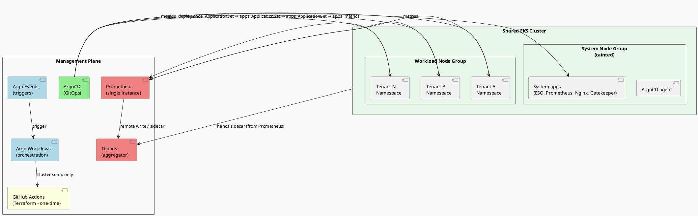
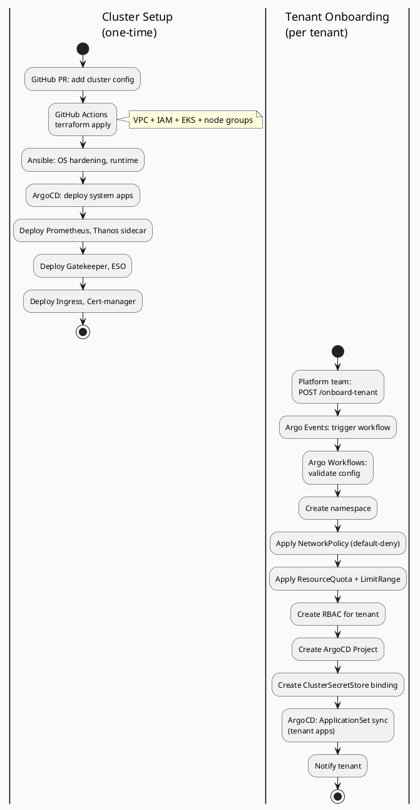

# Architecture Overview

## System Purpose

This platform provisions isolated tenant namespaces within a single, shared EKS cluster.
All tenants run on the same Kubernetes control plane but maintain strong isolation via NetworkPolicy,
ResourceQuota, RBAC, and Gatekeeper admission constraints. Tenants are onboarded in ~2-3 minutes
via Kubernetes-level operations, with no infrastructure provisioning per tenant.

## Component Responsibilities

| Component | Layer | Owns |
| --- | --- | --- |
| Terraform | Infrastructure | Single EKS cluster (one-time), VPC, subnets, IAM roles, node groups |
| GitHub Actions | CI/CD | Terraform execution (cluster setup only), drift detection, plan/apply pipeline |
| Ansible | Configuration | Node bootstrap, runtime config, OS hardening (one-time, shared nodes) |
| Argo Workflows | Orchestration | Namespace provisioning, quota/policy application, ArgoCD project creation, ESO binding |
| Argo Events | Automation | Event ingestion, webhook handling, trigger routing for tenant onboarding |
| ArgoCD | GitOps | System apps (deployed once); per-tenant ApplicationSet for namespace-scoped apps |
| Prometheus | Monitoring | Single instance scraping all namespaces; tenant isolation via `namespace` label |
| Thanos | Monitoring | Long-term metric storage, same as before |
| Gatekeeper | Admission | Cluster-wide policy enforcement: no privileged pods, no host access, system taint blocking |
| Python | Scripting | Automation scripts, CLI tooling, API glue |

## High-Level Architecture

## Provisioning Pipeline Flow

## Cluster Architecture (Shared)

A single EKS cluster hosts all tenants, structured as:

* **System node group** (tainted `node-role=system:NoSchedule`) — runs platform components (ArgoCD, Prometheus, Gatekeeper, Ingress, ESO)
* **Workload node group** (no taint) — runs all tenant application pods, isolated per namespace
* Node groups are shared; tenants are isolated at the namespace + NetworkPolicy + RBAC layer

## Tenant Isolation Model

Each tenant is isolated through multiple layers:

| Boundary | Mechanism | Enforcement |
| --- | --- | --- |
| **Network** | Default-deny NetworkPolicy | Kubernetes (Calico/Cilium CNI) |
| **Storage** | Namespace-scoped PVCs | Kubernetes; Gatekeeper blocks host mounts |
| **Compute** | ResourceQuota + LimitRange per namespace | Kubernetes API admission |
| **IAM/Secrets** | Per-tenant ClusterSecretStore scoped to `/<tenant-id>/*` | AWS Secrets Manager path restriction + ESO RBAC |
| **RBAC** | Namespace-scoped service accounts and roles | Kubernetes RBAC, Gatekeeper blocks cluster-scoped creations |
| **Pod Security** | Gatekeeper constraints | Admission controller: prevents privileged pods, hostNetwork, host mounts, system taint toleration |

## GitOps Source of Truth

The `src/app-of-apps/` directory and `tenants/<tenant-id>/config.yaml` in this repository are the
source of truth for all deployed state. No resource should exist in the cluster that is not
tracked by ArgoCD or Kubernetes ConfigMaps.

See [argocd.md](argocd.md) for structure.

## Key Design Decisions

### Single shared cluster with namespace isolation (vs dedicated clusters)

**Rationale:**
- Dramatically reduced infrastructure cost and operational overhead
- Tenant onboarding in ~2-3 minutes (Kubernetes-level, no IaC)
- Simpler platform maintenance (one control plane, one monitoring stack)
- Shared node resources with strong isolation (NetworkPolicy, RBAC, quotas, admission)

**Trade-offs:**
- Smaller blast radius per tenant (namespace-scoped, not cluster-scoped)
- Cluster upgrades affect all tenants simultaneously (mitigated by maintenance windows and blue-green cluster strategy)
- Resource contention requires careful quota tuning (per-tier quotas defined in config.yaml)

### Argo Workflows for namespace provisioning (vs static manifests)

Argo Workflows provides:
- Stateful orchestration of multi-step onboarding (namespace → quota → RBAC → ESO → ArgoCD project)
- Validation and error handling before resource creation
- Clean audit trail and retry logic
- Integration with Argo Events for webhook-driven triggers

### Per-namespace Prometheus labels (vs separate Prometheus per tenant)

A single Prometheus instance scrapes all namespaces and applies `namespace` label to metrics.
Thanos and Grafana filter by namespace, avoiding duplication and cost.

### ApplicationSet pattern for tenant workloads (vs per-tenant Applications)

ApplicationSet generates Applications dynamically per tenant directory, providing:
- DRY configuration (one template, multiple instances)
- Automatic discovery (add tenant config, ApplicationSet creates Application)
- Namespace-scoped project isolation

### On-demand cost saving via full cluster lifecycle (development use)

The cluster is provisioned at the start of a work session and destroyed when done. This achieves
true zero idle cost — no control plane, no nodes, no NAT gateways running overnight.

**Provision flow** (`provision-cluster` GitHub Actions workflow):
1. `terraform apply` — VPC, IAM, EKS cluster, node groups, addons (~15-18 min)
2. Bootstrap ArgoCD into the fresh cluster (kubectl apply, chicken-and-egg solved in GHA)
3. Apply the App-of-Apps Application → ArgoCD syncs all 7 system apps (~3-5 min)
4. Cluster ready for tenant onboarding

**Destroy flow** (`destroy-cluster` GitHub Actions workflow):
1. Pre-destroy drain: delete all `Service` objects of type `LoadBalancer` across namespaces
   (required — orphaned ALB/NLB ENIs will block VPC deletion)
2. `terraform destroy` — removes all resources cleanly

**State recovery after reprovision:**
- Tenant configs: Git (`tenants/` directory) — fully durable, no data loss
- Secrets: AWS Secrets Manager — survive cluster destroy, re-synced by ESO on next provision
- Metrics: Thanos S3 bucket — survives cluster destroy (Thanos upload interval set to 5 min,
  not 2 h, to minimize in-flight data loss at destroy time)
- ArgoCD state: re-bootstrapped from Git on each provision (stateless by design)

**Cold start time:** ~20-25 min total. Acceptable for development sessions.
