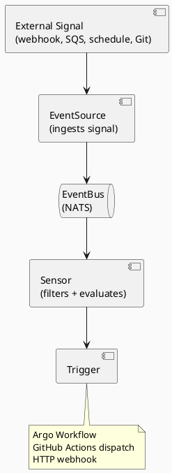
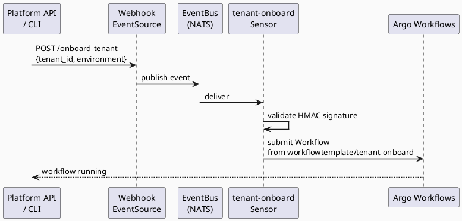

# Argo Events

## Role in the Platform

Argo Events is the event-driven automation layer. It watches for external signals and translates
them into Argo Workflow or GitHub Actions triggers.



Namespace: `argo-events`\
EventBus: NATS (3-node HA cluster)

## EventSource Catalog

### Webhook — Tenant Lifecycle Operations

```yaml
apiVersion: argoproj.io/v1alpha1
kind: EventSource
metadata:
  name: webhook-source
  namespace: argo-events
spec:
  webhook:
    onboard-tenant:
      port: "12000"
      endpoint: /onboard-tenant
      method: POST
    offboard-tenant:
      port: "12000"
      endpoint: /offboard-tenant
      method: POST
    upgrade-tenant:
      port: "12000"
      endpoint: /upgrade-tenant
      method: POST
```

Webhook payloads must include an HMAC-SHA256 signature header (`X-Platform-Signature`).

### GitHub — Tenant Config Change

Watches push/PR events to the `tenants/` path for config validation.

### Calendar — Scheduled Events

|     |     |
| --- | --- |
| Event Name | Schedule (UTC) |
| `daily-health-check` | `0 6 * * *` |
| `monthly-secret-rotation` | `0 2 1 * *` |
| `drift-detection` | `0 2 * * *` |

### SQS — AWS Events

Listens for EC2 spot interruption notices and EKS update notifications forwarded via
EventBridge → SQS (`platform-eks-events` queue).

### Resource Watch — ArgoCD App Health

Watches for ArgoCD `Application` resources entering `Degraded` health state.
Triggers Slack alert when detected.

## Sensor Catalog

### `tenant-onboard-sensor`



### `daily-health-check-sensor`

Triggered by `calendar-source/daily-health-check`. Submits the `cluster-health-check`
WorkflowTemplate with no parameters (runs against all registered clusters).

### `argocd-degraded-sensor`

Triggers an HTTP action to the Slack webhook when any ArgoCD Application enters Degraded state.
Includes the application name and affected cluster in the alert payload.

### `spot-interruption-sensor`

Reacts to EC2 spot interruption notices from SQS:

1. Identify affected tenant cluster from instance tags
2. Trigger `cluster-health-check` workflow for that tenant after 2-minute delay
3. Post Slack alert with affected node info

## GitHub Actions Dispatch Bridge

When a sensor needs to trigger GitHub Actions rather than an Argo Workflow, it uses
an HTTP trigger directly to the GitHub API:

```yaml
triggers:
  - template:
      name: dispatch-gha
      http:
        url: https://api.github.com/repos/<org>/<repo>/actions/workflows/provision-tenant-cluster.yaml/dispatches
        method: POST
        headers:
          Authorization: "Bearer {{ .EnvSecret.GH_TOKEN }}"
          Accept: application/vnd.github+json
        payload:
          - src:
              dependencyName: onboard-request
              dataKey: body
            dest: body.inputs
```

## Security

* Webhook endpoints validate HMAC-SHA256 signatures before processing
* Sensor service accounts have minimal RBAC — submit Workflows to `argo` namespace only
* GitHub event source validates `X-Hub-Signature-256` headers
* SQS messages are encrypted at rest (SSE-SQS) and in transit
* No sensor has direct AWS API access — AWS calls are delegated to Argo Workflow steps via IRSA

## Observability

* Argo Events exports Prometheus metrics: event counts, sensor trigger latency, error rates
* Failed events are logged to CloudWatch `/platform/argo-events`
* Pending events older than 5 minutes trigger a staleness alert
