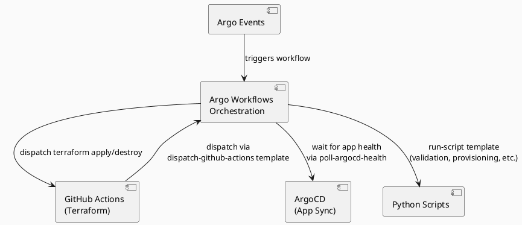
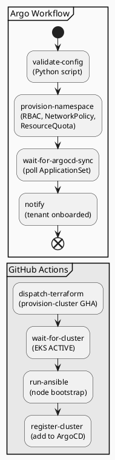

# Argo Workflows

## Role in the Platform

Argo Workflows is the orchestration engine for all multi-step lifecycle operations.
It runs in the management cluster and coordinates actions across Terraform (via GitHub Actions),
Ansible, ArgoCD, and Python scripts.

Argo Workflows handles everything that happens **after** infrastructure exists —
GitHub Actions handles everything that creates the infrastructure.



## Installation

Argo Workflows is deployed to the management cluster via ArgoCD:

```
argocd/management/argo-workflows.yaml
```

Namespace: `argo`
RBAC: Workflow pods use the `platform-argo-workflow-runner` IRSA role for AWS API access.

## Workflow Template Catalog

### `tenant-onboard`

Full tenant provisioning pipeline. See [tenant-lifecycle.md](tenant-lifecycle.md) for step-by-step detail.



#### `tenant-onboard` Workflow Definition

```yaml
apiVersion: argoproj.io/v1alpha1
kind: WorkflowTemplate
metadata:
  name: tenant-onboard
  namespace: argo
spec:
  entrypoint: onboard
  arguments:
    parameters:
      - name: tenant_id
  templates:
    - name: onboard
      steps:
        # Step 1: Validate the tenant config.yaml against schema
        - - name: validate-config
            template: run-script
            arguments:
              parameters:
                - name: script
                  value: "src/scripts/validate_tenant_config.py --tenant-id {{inputs.parameters.tenant_id}}"

        # Step 2: Create namespace and apply all isolation policies (single shared cluster)
        - - name: provision-namespace
            template: run-script
            arguments:
              parameters:
                - name: script
                  value: "src/scripts/provision_namespace.py --tenant-id {{inputs.parameters.tenant_id}}"

        # Step 3: Wait for ArgoCD ApplicationSet to generate and sync the tenant's Application
        - - name: wait-for-argocd-sync
            template: poll-argocd-health
            arguments:
              parameters:
                - name: app_name
                  value: "{{inputs.parameters.tenant_id}}"

        # Step 4: Notify tenant that onboarding is complete
        - - name: notify
            template: run-script
            arguments:
              parameters:
                - name: script
                  value: "src/scripts/notify_tenant.py --tenant-id {{inputs.parameters.tenant_id}} --event onboard-complete"
```

### `tenant-offboard`

Teardown pipeline. Requires manual approval step.

Key steps: drain workloads → backup check → deregister monitoring → delete ArgoCD project → delete namespace → archive config to `tenants/_archived/<tenant-id>/`.

The manual approval gate uses an Argo Workflows `suspend` template:

```yaml
- name: confirm-offboard
  suspend:
    duration: "0"   # Suspends indefinitely until manually resumed
```

### `cluster-provision`

Dispatches the `provision-cluster.yaml` GitHub Actions workflow and waits for the cluster to
reach a fully healthy state before returning. Used to start the development environment.

Key steps: dispatch GHA terraform apply → poll until cluster ACTIVE → poll until all ArgoCD
system apps Healthy → post ready notification to Slack.

### `cluster-destroy`

Pre-destroy cleanup followed by dispatching the `destroy-cluster.yaml` GitHub Actions workflow.
**Pre-destroy is mandatory** — LoadBalancer services create AWS ALBs/NLBs whose ENIs will
block VPC deletion if not removed first.

Key steps: list all `Service/LoadBalancer` objects → delete each → wait for ENI detachment
(~2 min) → dispatch GHA terraform destroy → archive any remaining tenant configs.

### `tenant-upgrade`

EKS version upgrade pipeline:

1. Pre-flight addon compatibility check (Python script queries AWS EKS addon versions API)
2. Dispatch GitHub Actions upgrade workflow
3. Poll until all nodes are on new version
4. Run Ansible for any updated runtime config
5. Post-upgrade health check

### `cluster-health-check`

Scheduled daily. Checks all active tenant clusters:

* All system pods in Running state
* ArgoCD apps all Healthy/Synced
* Prometheus targets all UP
* Node conditions all Ready

Posts summary to Slack. Creates incident ticket if any cluster fails checks.

### `rotate-secrets`

Scheduled monthly. For each tenant:

1. Generates new secret value (or triggers AWS rotation)
2. ESO picks up new version on next sync cycle
3. Verifies pods receive updated secret (by checking pod restart or config hash)

## Reusable Templates

### `dispatch-github-actions`

```yaml
- name: dispatch-github-actions
  inputs:
    parameters:
      - name: workflow
      - name: inputs
  script:
    image: python:3.11-slim
    command: [python]
    source: |
      import os, json, requests, time

      token = os.environ["GH_TOKEN"]
      org = os.environ["GH_ORG"]
      repo = os.environ["GH_REPO"]
      workflow = "{{inputs.parameters.workflow}}"
      inputs = json.loads("""{{inputs.parameters.inputs}}""")

      # Dispatch
      r = requests.post(
          f"https://api.github.com/repos/{org}/{repo}/actions/workflows/{workflow}/dispatches",
          headers={"Authorization": f"Bearer {token}", "Accept": "application/vnd.github+json"},
          json={"ref": "main", "inputs": inputs}
      )
      r.raise_for_status()

      # Poll for completion
      time.sleep(10)
      # ... poll /actions/runs until completed
    env:
      - name: GH_TOKEN
        valueFrom:
          secretKeyRef:
            name: github-token
            key: token
      - name: GH_ORG
        value: "<org>"
      - name: GH_REPO
        value: "<repo>"
```

### `poll-eks-status`

Polls AWS EKS API until cluster status is `ACTIVE`. Timeout: 25 minutes.

### `poll-argocd-health`

Polls ArgoCD API until named Application reaches `Healthy` + `Synced`. Timeout: 10 minutes.

### `run-script`

Generic template that runs a Python script from the `src/scripts/` directory:

```yaml
- name: run-script
  inputs:
    parameters:
      - name: script
  script:
    image: <ecr-uri>/platform-scripts:latest
    command: [python]
    source: |
      import subprocess
      result = subprocess.run(
          "{{inputs.parameters.script}}".split(),
          check=True, capture_output=True, text=True
      )
      print(result.stdout)
    serviceAccountName: argo-workflow-runner
```

## Artifact Storage

Workflow artifacts (Terraform plan outputs, health check reports, logs) are stored in S3:

```
s3://<platform-artifacts-bucket>/
└── workflows/
    └── <workflow-name>/
        └── <workflow-uid>/
            └── <step-name>.tar.gz
```

Configured in `workflow-controller-configmap`:

```yaml
artifactRepository:
  s3:
    bucket: <platform-artifacts-bucket>
    endpoint: s3.amazonaws.com
    region: eu-west-1
    keyFormat: "workflows/{{workflow.name}}/{{workflow.uid}}/{{pod.name}}"
```

## Retry and Failure Handling

Global retry policy applied to all templates unless overridden:

```yaml
retryStrategy:
  limit: 2
  retryPolicy: OnFailure
  backoff:
    duration: 30s
    factor: 2
    maxDuration: 5m
```

On workflow failure:

* Workflow status is set to `Failed`
* Argo Events sensor detects the failure and triggers a notification workflow
* Alert posted to `#platform-alerts` Slack with link to workflow UI

## RBAC

Workflow pods use the `argo-workflow-runner` Kubernetes service account, which is bound
to the `platform-argo-workflow-runner` IRSA role.

Kubernetes RBAC allows the service account to:

* Create/read/update Workflow resources in `argo` namespace
* Read ConfigMaps and Secrets in `argo` namespace
* Read cluster state (nodes, pods) across namespaces (read-only)

Humans accessing Argo Workflows UI authenticate via SSO (same OIDC provider as ArgoCD).
Platform team members have admin access; read-only access is granted by default.

## Workflow Submission

Workflows are submitted by Argo Events sensors (automated) or via CLI (manual):

```bash
# Manual trigger - tenant onboard
 argo submit --from workflowtemplate/tenant-onboard \
  -p tenant_id=acme-corp \
  -n argo

# Watch progress
argo watch <workflow-name> -n argo

# View logs
argo logs <workflow-name> -n argo --follow
```
