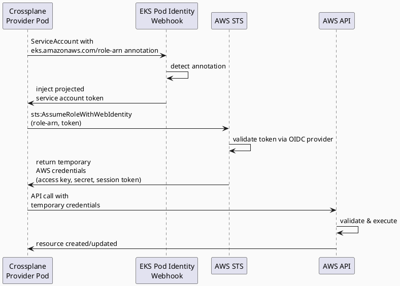
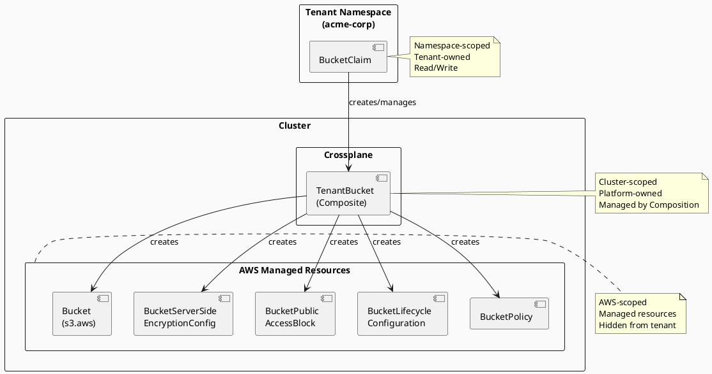

# Crossplane — Day 1 AWS Resource Management

## Role in the Platform

Crossplane is the Day 1 AWS resource management layer. After Terraform has
provisioned the cluster once (Day 0), all per-tenant AWS resources — S3 buckets,
IAM roles, RDS instances, SQS queues — are created, updated, and deleted by
Crossplane Compositions. This keeps Terraform state clean and makes tenant
resource lifecycle fully GitOps-driven via ArgoCD.

## Day 0 / Day 1 Boundary

| Concern | Day 0 — Terraform | Day 1 — Crossplane |
|---|---|---|
| VPC, subnets, NAT | ✅ | ✗ |
| EKS control plane + node groups | ✅ | ✗ |
| OIDC provider for IRSA | ✅ | ✗ |
| Crossplane provider IAM role | ✅ | ✗ |
| Per-tenant S3 bucket | ✗ | ✅ |
| Per-tenant IRSA role | ✗ | ✅ |
| Per-tenant RDS instance | ✗ | ✅ |
| Per-tenant SQS queue | ✗ | ✅ |

The rule: if it is created once for the cluster, it belongs in Terraform.
If it is created once per tenant, it belongs in Crossplane.

## Authentication — IRSA

The AWS provider pod authenticates to AWS using IRSA (IAM Roles for Service
Accounts) — no static credentials anywhere.

```
EKS Pod Identity Webhook
  │
  ├── detects provider-aws ServiceAccount annotation:
  │     eks.amazonaws.com/role-arn: arn:aws:iam::<account>:role/crossplane-provider-aws
  │
  └── injects projected service account token as a volume mount
        ↓
AWS SDK (inside provider pod) calls:
  sts:AssumeRoleWithWebIdentity
    RoleArn:          arn:aws:iam::<account>:role/crossplane-provider-aws
    WebIdentityToken: <projected token>
        ↓
  Returns temporary credentials — no access keys stored anywhere
```

The IRSA trust policy (created by Terraform in `src/terraform/modules/iam/`) allows:

```json
{
  "Effect": "Allow",
  "Principal": { "Federated": "<oidc-provider-arn>" },
  "Action": "sts:AssumeRoleWithWebIdentity",
  "Condition": {
    "StringEquals": {
      "<oidc-url>:sub": "system:serviceaccount:crossplane-system:provider-aws",
      "<oidc-url>:aud": "sts.amazonaws.com"
    }
  }
}
```

The permissions policy on `crossplane-provider-aws` is scoped to only the AWS
services Crossplane manages (S3, IAM, RDS, SQS) — no `AdministratorAccess`.



## Repository Structure

```
src/crossplane/
├── providers/
│   ├── provider-aws.yaml        # Provider CRD — pins provider version
│   ├── runtime-config.yaml      # DeploymentRuntimeConfig + ServiceAccount (IRSA annotation)
│   └── provider-config.yaml     # ProviderConfig — WebIdentity auth
├── xrds/
│   ├── tenant-bucket.yaml       # XRD + Claim schema for S3 buckets
│   └── tenant-iam-role.yaml     # XRD + Claim schema for IRSA roles
└── compositions/
    ├── tenant-bucket/
    │   └── composition.yaml     # S3 bucket + encryption + public-block + policy
    └── tenant-iam-role/
        └── composition.yaml     # IAM role + scoped policy + attachment
```

ArgoCD deploys these in sync-wave order:

```
wave -2  crossplane (core Helm chart)
wave -1  crossplane-provider-aws (Provider + RuntimeConfig + ProviderConfig)
wave  0  crossplane-compositions (XRDs + Compositions)
```

Compositions must not be applied before the provider CRDs are installed —
the sync-wave annotations enforce this ordering.

## Composites and Claims

Crossplane uses a two-level resource model:



Tenants submit **Claims** (namespace-scoped). The platform owns **Composites**
and **Managed Resources** (cluster-scoped). Tenants cannot see or modify the
underlying AWS resources directly — only the Claim.

## Platform Compositions

### `tenant-bucket`

Creates a private, encrypted S3 bucket for a tenant:

- AES256 server-side encryption
- All public access blocked
- Non-current version expiry lifecycle rule (default 90 days)
- Bucket policy granting read/write to the tenant's IRSA role ARN only

Claim schema (`BucketClaim`):

```yaml
spec:
  parameters:
    tenantId: acme-corp          # required
    region: eu-west-1            # default: eu-west-1
    versioning: true             # default: false
    lifecycleDays: 90            # default: 90
    irsaRoleArn: arn:aws:...     # set by onboarding workflow
```

### `tenant-iam-role`

Creates a scoped IRSA role for a tenant workload service account:

- Trust policy: `sts:AssumeRoleWithWebIdentity` scoped to the tenant namespace SA
- Permissions policy: `secretsmanager:GetSecretValue` on `/<tenantId>/*` only
- Permissions policy: `s3:*` on `<tenantId>-data` bucket only

Claim schema (`IAMRoleClaim`):

```yaml
spec:
  parameters:
    tenantId: acme-corp
    serviceAccountName: acme-corp-workload
    oidcProviderArn: arn:aws:iam::<account>:oidc-provider/...
    oidcProviderUrl: oidc.eks.eu-west-1.amazonaws.com/id/<id>
    secretsPrefix: /acme-corp/
```

## Tenant Claims

Each tenant has a `tenants/<tenant-id>/crossplane/claims.yaml` file containing
their resource claims. This is delivered to the tenant namespace by ArgoCD via
`tenants/<tenant-id>/argocd/apps.yaml`.

Onboarding order:

1. `IAMRoleClaim` submitted → Crossplane creates IAM role → `status.roleArn` populated
2. Onboarding workflow reads `status.roleArn` and patches `BucketClaim.spec.parameters.irsaRoleArn`
3. `BucketClaim` submitted → Crossplane creates S3 bucket with scoped bucket policy

Offboarding: deleting the Claim triggers Crossplane to delete the underlying AWS
resources (the `resources-finalizer` on the Composite handles cleanup).

## Adding a New Composition

1. Define the XRD in `src/crossplane/xrds/<resource>.yaml`
2. Implement the Composition in `src/crossplane/compositions/<resource>/composition.yaml`
3. Add the Claim schema to the XRD `claimNames` section
4. Test with a claim in `tenants/example-tenant/crossplane/`
5. Run `helm-validate` and `security-scan` agents before merging
6. `crossplaneCompositions` app in ArgoCD syncs on next manual sync (autoSync off)

## Observability

Crossplane exposes metrics on `:8080/metrics`. Prometheus scrapes them via the
`monitoring` namespace with the standard `namespace` label. Key metrics:

- `crossplane_managed_resource_ready` — 1 when the resource is synced and healthy
- `crossplane_managed_resource_synced` — 1 when last reconcile succeeded
- `crossplane_composition_reconcile_errors_total` — composition errors by type

Alert on `crossplane_managed_resource_ready == 0` for more than 5 minutes on
any tenant resource.

## See Also

- `docs/iam-conventions.md` — IAM role naming and policy scoping conventions
- `docs/secrets.md` — how ESO reads secrets from the IRSA-authenticated prefix
- `docs/argocd.md` — sync-wave ordering and ArgoCD project config
- `docs/tenant-lifecycle.md` — full onboarding sequence including claim submission
