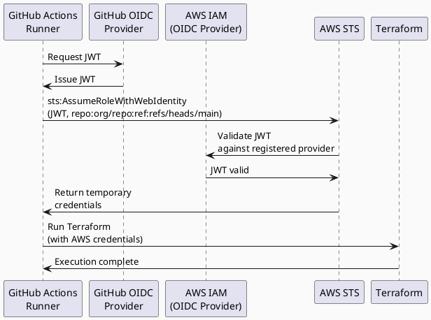
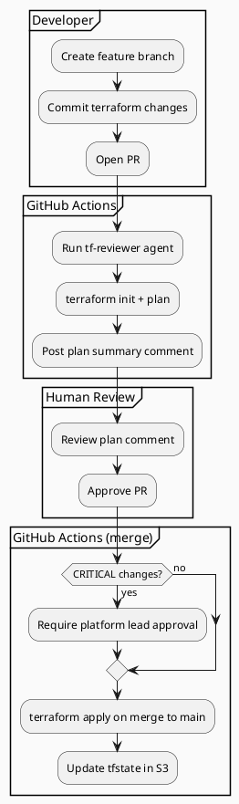

# GitHub Actions — Terraform Pipeline

## Purpose

GitHub Actions is the execution layer for **cluster-level Terraform operations only**.
Per-tenant provisioning is handled by Argo Workflows (Kubernetes-level).

GHA provides: audit trail, PR-linked plan comments, approval gates, and OIDC-based AWS auth.

## Authentication — OIDC (No Static Credentials)

AWS authentication uses OpenID Connect (OIDC). No IAM access keys exist in GitHub secrets.

### How It Works

1. GitHub Actions requests a JWT from GitHub's OIDC provider
2. AWS STS validates the JWT against the configured IAM OIDC provider
3. STS returns temporary credentials for the Terraform execution role
4. Credentials are scoped to the specific workflow, branch, and repository



### IAM OIDC Provider Setup

```hcl
# In management Terraform (one-time setup)
resource "aws_iam_openid_connect_provider" "github" {
  url             = "https://token.actions.githubusercontent.com"
  client_id_list  = ["sts.amazonaws.com"]
  thumbprint_list = ["<github-oidc-thumbprint>"]
}
```

### Trust Policy on Terraform Execution Role

```json
{
  "Effect": "Allow",
  "Principal": {
    "Federated": "arn:aws:iam::<account-id>:oidc-provider/token.actions.githubusercontent.com"
  },
  "Action": "sts:AssumeRoleWithWebIdentity",
  "Condition": {
    "StringEquals": {
      "token.actions.githubusercontent.com:aud": "sts.amazonaws.com"
    },
    "StringLike": {
      "token.actions.githubusercontent.com:sub": "repo:<org>/<repo>:*"
    }
  }
}
```

### GHA Workflow Step

```yaml
- name: Configure AWS credentials
  uses: aws-actions/configure-aws-credentials@v4
  with:
    role-to-assume: arn:aws:iam::<account-id>:role/platform-terraform-execution
    aws-region: ${{ inputs.aws_region }}
```

## Workflow Catalog

### `provision-cluster.yaml`

Starts the development cluster from scratch. Triggered manually via `workflow_dispatch`.
This is the primary on-demand provisioning workflow — run at the start of a work session.

**Inputs:**
* `environment` — `staging` | `production` (default: `staging`)

**Jobs:**
1. **terraform-apply** — `terraform init` + `terraform apply -auto-approve`
2. **bootstrap-argocd** — `kubectl apply` ArgoCD manifests into fresh cluster, create App-of-Apps Application
3. **wait-healthy** — Poll ArgoCD API until all 7 system apps reach `Healthy`+`Synced` (timeout: 15 min)
4. **notify** — Post cluster endpoint + kubeconfig instructions to Slack `#platform-alerts`

Total time: ~20-25 min.

### `destroy-cluster.yaml`

Destroys the development cluster cleanly. Triggered manually via `workflow_dispatch`.
Run at the end of a work session to stop all AWS costs.

**Pre-destroy (mandatory):** Deletes all `Service` objects of type `LoadBalancer` across all
namespaces before running Terraform. Without this step, orphaned ALB/NLB ENIs block VPC deletion.

**Jobs:**
1. **pre-destroy-drain** — `kubectl delete svc --all-namespaces -l ...` for LoadBalancer type, wait 2 min for ENI detachment
2. **terraform-destroy** — `terraform destroy -auto-approve`
3. **notify** — Post destruction confirmation to Slack

### `plan-cluster.yaml` — Drift Detection

Triggered by schedule (daily at 02:00 UTC) or manually.
Runs `terraform plan` on the cluster for drift detection.
Posts a summary to Slack if drift is detected. Never applies — human review required.

```bash
# Drift detection workflow
terraform plan -out=plan.tfplan

# If drift detected, log alert
if [ -s plan.tfplan ]; then
  echo "Drift detected!"
  # Post to Slack...
fi
```

## Environments and Approval Gates

| Environment | Branch | Approval Required | Approvers |
| --- | --- | --- | --- |
| staging | `develop` or `main` | No | — |
| production | `main` | Yes | Platform team (min 1) |

GitHub Environments are configured under Settings → Environments.
Production environment has `required_reviewers` set to the `platform-team` group.

## Plan Comments on PRs



When a PR modifies files under `src/terraform/`, the plan job runs automatically
and posts a formatted plan summary as a PR comment.

```
## Terraform Plan — Cluster Setup

+ 47 to add  ~ 3 to change  - 0 to destroy
```

## State Backend

Terraform state is stored in S3:

```
s3://<platform-state-bucket>/
└── cluster/
    └── terraform.tfstate
```

DynamoDB table `terraform-locks` is used for state locking.
State bucket has versioning enabled and MFA-delete protection.

See [terraform.md](terraform.md) for full state configuration.

## Secrets in GitHub Actions

Only non-sensitive configuration is passed as workflow inputs.

| Secret | Purpose |
| --- | --- |
| `TERRAFORM_STATE_BUCKET` | S3 bucket name for state |
| `TERRAFORM_LOCK_TABLE` | DynamoDB table name |
| `TERRAFORM_ROLE_ARN` | IAM role to assume via OIDC |
| `SLACK_WEBHOOK_URL` | For drift detection alerts |

**Note**: No AWS access keys are stored as secrets. OIDC is the only authentication method.

## Per-Tenant IAM Role Creation

When a new tenant is onboarded, Terraform creates per-tenant IAM roles.
This is triggered via the `tenant-onboard` Argo Workflow:

```python
# src/scripts/trigger_gha.py
import requests

def trigger_iam_role_creation(tenant_id: str):
    """Dispatch GitHub Actions to create tenant IAM roles"""
    response = requests.post(
        f"https://api.github.com/repos/{ORG}/{REPO}/actions/workflows/create-tenant-iam-roles.yaml/dispatches",
        headers={"Authorization": f"Bearer {GH_TOKEN}"},
        json={
            "ref": "main",
            "inputs": {
                "tenant_ids": json.dumps([tenant_id]),
                "environment": "production"
            }
        }
    )
    response.raise_for_status()
```

This GHA workflow updates `src/terraform/cluster.tfvars` with the new tenant ID,
runs `terraform apply`, and commits any changes.

## Notifications

Failed workflows post to the `#platform-alerts` Slack channel via a reusable `notify` job.
All Terraform applies (successful or failed) are logged to CloudWatch Log Group `/platform/terraform-applies`.

## Key Differences from Old Model

**Old**: Per-tenant provisioning via GHA → terraform apply per tenant
**New**: Cluster setup via GHA once → per-tenant IAM roles created once → per-tenant Kubernetes operations via Argo Workflows

GHA is now minimal and focuses only on cluster infrastructure. All tenant-level operations
are Kubernetes-native and handled by Argo Workflows.
