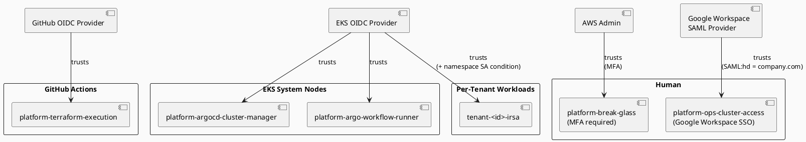
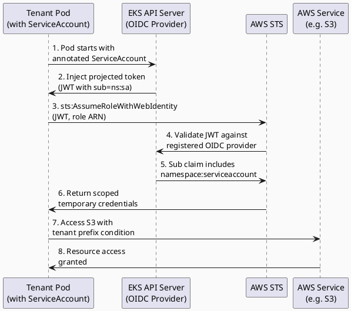

# IAM Design & Conventions

## Principles

* **Least privilege** — every role has only the permissions it needs, nothing more
* **IRSA everywhere** — workloads authenticate to AWS via IAM Roles for Service Accounts, never via node instance profiles
* **No static credentials** — no IAM access keys for any automated process; OIDC or instance metadata only
* **Tenant scoping** — tenant IAM roles are bounded to that tenant's resources via resource-level conditions
* **No cross-tenant access** — IAM policy conditions enforce tenant boundary

## Role Taxonomy



### Management Plane Roles

These roles exist once and manage platform infrastructure.

|     |     |     |
| --- | --- | --- |
| Role | Used By | Purpose |
| `platform-terraform-execution` | GitHub Actions (OIDC) | One-time cluster setup; Terraform apply only |
| `platform-argocd-cluster-manager` | ArgoCD management plane | Cluster registration, kubeconfig generation |
| `platform-argo-workflow-runner` | Argo Workflow pods | Dispatching GHA, reading tenant config from S3 |
| `platform-break-glass` | Human (MFA required) | Emergency read/write access |

### Per-Tenant Roles (IRSA)

These roles are created by the `iam-tenant` Terraform module (one-time, at cluster setup).
Each role has a suffix with the tenant ID, making per-tenant scope explicit.

|     |     |     |     |
| --- | --- | --- | --- |
| Role Pattern | Service Account | Namespace | Permissions |
| `<tenant-id>-external-secrets` | `external-secrets` | `<tenant-id>` | `secretsmanager:GetSecretValue` on `/<tenant-id>/*` |
| `<tenant-id>-thanos-sidecar` | `prometheus` | `monitoring` | `s3:PutObject`, `s3:GetObject` on `<tenant-id>-metrics/*` |
| `<tenant-id>-load-balancer-controller` | `aws-load-balancer-controller` | `kube-system` | ELB management, EC2 describe |
| `<tenant-id>-cluster-autoscaler` | `cluster-autoscaler` | `kube-system` | ASG describe/set desired capacity |
| `<tenant-id>-ebs-csi-driver` | `ebs-csi-controller-sa` | `kube-system` | EC2 volume create/attach/delete |

**Note**: Load balancer controller and cluster autoscaler are shared across all tenants (they run in `kube-system`)
but scoped to tenant-specific resources via resource tagging in their IAM policies.

## Tenant-Scoped ESO Role

Each tenant gets a dedicated External Secrets Operator role scoped to that tenant's namespace.

### Trust Policy

```json
{
  "Version": "2012-10-17",
  "Statement": [
    {
      "Effect": "Allow",
      "Principal": {
        "Federated": "arn:aws:iam::<account-id>:oidc-provider/oidc.eks.<region>.amazonaws.com/id/<cluster-oidc-id>"
      },
      "Action": "sts:AssumeRoleWithWebIdentity",
      "Condition": {
        "StringEquals": {
          "oidc.eks.<region>.amazonaws.com/id/<cluster-oidc-id>:sub":
            "system:serviceaccount:<tenant-id>:external-secrets",
          "oidc.eks.<region>.amazonaws.com/id/<cluster-oidc-id>:aud":
            "sts.amazonaws.com"
        }
      }
    }
  ]
}
```

The `sub` condition binds the role to the External Secrets service account **in the tenant's namespace only**.
A pod in a different namespace or using a different service account cannot assume the role.

### IAM Policy

```json
{
  "Version": "2012-10-17",
  "Statement": [
    {
      "Effect": "Allow",
      "Action": [
        "secretsmanager:GetSecretValue",
        "secretsmanager:DescribeSecret"
      ],
      "Resource": "arn:aws:secretsmanager:<region>:<account-id>:secret:/<tenant-id>/*"
    }
  ]
}
```

Even if the trust policy were compromised, the role can only access secrets under the `/<tenant-id>/*` path
in AWS Secrets Manager. Cross-tenant secret access is blocked at both the IRSA and IAM levels.

## IRSA Trust Pattern



## Shared System Roles Scoped by Resource

Roles used by shared system components (Prometheus, load balancer controller, cluster autoscaler)
are created once but scoped per tenant via resource tags in their IAM policies.

### Example: Thanos Sidecar Role (in Prometheus Pod)

Prometheus runs in the shared `monitoring` namespace and has a service account with an IRSA role
that can write metrics to the S3 bucket. The IAM policy scopes write access per tenant by tenant ID tag:

```json
{
  "Version": "2012-10-17",
  "Statement": [
    {
      "Effect": "Allow",
      "Action": [
        "s3:PutObject",
        "s3:GetObject"
      ],
      "Resource": "arn:aws:s3:::<platform-metrics-bucket>/*",
      "Condition": {
        "StringLike": {
          "s3:x-amz-tagging": "*TenantID=<tenant-id>*"
        }
      }
    }
  ]
}
```

In practice, Prometheus writes to prefix-separated paths (`s3://bucket/<tenant-id>/...`)
and the Thanos sidecar pod sets the tenant ID via its ClusterSecretStore configuration.

## Terraform Execution Role

The `platform-terraform-execution` role is assumed by GitHub Actions (via OIDC) to run
`terraform apply` for Day 0 cluster setup.

> **Ownership: CloudFormation, not Terraform.** This role is defined in a CloudFormation
> stack (`bootstrap/cfn-iam.yaml`), not in the Terraform modules. Creating it in Terraform
> would create a chicken-and-egg problem: Terraform needs the role to run, but the role
> would not exist until Terraform runs. CFN is applied once manually before any pipeline
> execution. GitHub org and repo are CloudFormation parameters, not Terraform variables —
> there is no `github_org` variable in the Terraform codebase.

**Permissions:**
* Creating/managing the single EKS cluster (one-time)
* Creating platform-level IAM roles (`iam-management` module)
* Managing shared resources (VPC, node groups, EKS addons)

**Security mitigations:**
* Trust policy restricts assumption to the specific GitHub org/repo (CFN parameters)
* CloudTrail logs all API calls made with this role
* The role cannot modify its own trust policy (deny condition below)
* Only used for cluster setup; no per-tenant infrastructure changes

```json
{
  "Effect": "Deny",
  "Action": "iam:UpdateAssumeRolePolicy",
  "Resource": "arn:aws:iam::<account-id>:role/platform-terraform-execution"
}
```

## EKS Cluster Access — Access Entry API

The cluster uses `authentication_mode = "API"` — the legacy `aws-auth` ConfigMap is
**not used**. All cluster access is managed through EKS Access Entries, visible in the
AWS Console under EKS → Cluster → Access and fully auditable via CloudTrail.

### How GitHub Actions gets cluster-admin

The chain has three parts, all in Terraform — no manual steps:

**Part 1 — OIDC trust** (`iam-management` module): the `platform-terraform-execution`
IAM role trusts `token.actions.githubusercontent.com` for the specific org/repo only.

```hcl
condition {
  test     = "StringLike"
  variable = "token.actions.githubusercontent.com:sub"
  values   = ["repo:<org>/<repo>:*"]
}
```

**Part 2 — EKS Access Entry** (`eks-cluster` module): the role is added as an
Access Entry with `AmazonEKSClusterAdminPolicy` at cluster scope.

```hcl
access_entries = merge({
  terraform = {
    principal_arn = var.terraform_role_arn      # platform-terraform-execution ARN
    type          = "STANDARD"
    policy_associations = {
      cluster_admin = {
        policy_arn   = "arn:aws:eks::aws:cluster-access-policy/AmazonEKSClusterAdminPolicy"
        access_scope = { type = "cluster" }
      }
    }
  }
}, ...)
```

**Part 3 — kubeconfig** (`provision-cluster.yaml`): the GHA job assumes the same OIDC
role, then generates a kubeconfig that uses it for token exchange.

```yaml
- uses: aws-actions/configure-aws-credentials@v4
  with:
    role-to-assume: ${{ secrets.TERRAFORM_ROLE_ARN }}   # platform-terraform-execution
    aws-region: ${{ secrets.AWS_REGION }}

- run: aws eks update-kubeconfig --name $CLUSTER_NAME --region $AWS_REGION
```

EKS generates a short-lived token (`aws eks get-token`) at kubectl invocation time.
The token is signed by STS and carries the assumed role ARN. EKS validates it against
the Access Entry table — no ConfigMap lookup involved.

### Access entry summary

| Entry | IAM Role | Access type | Scope | Used by |
|---|---|---|---|---|
| `terraform` | `platform-terraform-execution` | `AmazonEKSClusterAdminPolicy` | cluster | GitHub Actions (OIDC) |
| `break_glass` | `platform-break-glass` | `AmazonEKSClusterAdminPolicy` | cluster | Humans (MFA required) |
| `argocd` | `platform-argocd-cluster-manager` | Kubernetes group `platform:argocd` | RBAC-controlled | ArgoCD IRSA |
| `workflow_runner` | `platform-argo-workflow-runner` | Kubernetes group `platform:workflow-runner` | RBAC-controlled | Argo Workflows IRSA |

The `argocd` and `workflow_runner` entries use `kubernetes_groups` rather than EKS
managed policies so that the platform-rbac ArgoCD app owns the exact permissions via
ClusterRoleBindings — the IAM layer only establishes identity, Kubernetes RBAC controls authorization.

### Why not `system:masters`?

`system:masters` is a built-in Kubernetes group with unconditional cluster-admin that
cannot be audited at the Kubernetes RBAC level. `AmazonEKSClusterAdminPolicy` via
Access Entry is equivalent in practice but all access is visible in CloudTrail and
the AWS Console, and can be revoked without touching the cluster.

## Tenant RBAC vs. IAM

**Kubernetes RBAC** (via Roles/RoleBindings in tenant namespaces):
- Controls in-cluster API access (who can create pods, services, etc.)
- Scoped to namespace (tenant cannot create cluster-scoped resources)
- Managed by platform team; tenants can delegate to their own team members

**IAM IRSA**:
- Controls AWS API access (EC2, S3, Secrets Manager, etc.)
- Tenant workloads assume tenant-specific roles to access AWS resources
- Roles are scoped to tenant via resource conditions

Example flow:
1. Tenant creates a pod that needs to access an S3 bucket
2. Pod has a service account with IRSA annotation linking to `<tenant-id>-s3-reader` role
3. Role policy allows only `<tenant-id>/*` S3 objects
4. Pod's secret is mounted; workload reads secret and calls STS to assume role
5. STS verifies pod identity matches role's trust policy
6. Pod gets temporary credentials scoped to the bucket prefix

## IAM Naming Convention

```
<scope>-<tenant-id|platform>-<component>[-<sub>]

Examples:
  platform-terraform-execution
  platform-argocd-cluster-manager
  platform-argo-workflow-runner
  acme-corp-external-secrets
  acme-corp-thanos-sidecar
  acme-corp-ebs-csi-driver
```

All IAM resource names must follow this pattern. Terraform modules enforce this via local name construction.

## Permission Boundaries

All tenant IRSA roles have a Permission Boundary attached that prevents them from:

* Creating or modifying IAM roles/policies
* Accessing secrets outside their tenant prefix
* Making cross-region API calls (scoped to `aws:RequestedRegion`)

```json
{
  "Version": "2012-10-17",
  "Statement": [
    {
      "Effect": "Allow",
      "Action": "*",
      "Resource": "*"
    },
    {
      "Effect": "Deny",
      "Action": "iam:*",
      "Resource": "*"
    },
    {
      "Effect": "Deny",
      "Action": "secretsmanager:*",
      "Resource": "*",
      "Condition": {
        "StringNotLike": {
          "secretsmanager:SecretId": "arn:aws:secretsmanager:*:*:secret:/<tenant-id>/*"
        }
      }
    },
    {
      "Effect": "Deny",
      "Action": "*",
      "Resource": "*",
      "Condition": {
        "StringNotEquals": {
          "aws:RequestedRegion": "<cluster-region>"
        }
      }
    }
  ]
}
```

## AWS IAM Identity Center (SSO) with Google Workspace

IAM Identity Center is the modern approach for human operator access to AWS. Instead of
configuring a per-role SAML provider and requiring engineers to use `saml2aws`, Identity
Center acts as a central broker: one SAML trust between Google and Identity Center, then
fine-grained Permission Sets assigned to accounts. No per-role attribute XML or per-app
metadata files are needed as additional roles are added.

### 1. Overview — Why Identity Center vs. Direct SAML

| Concern | Direct SAML (`saml2aws`) | IAM Identity Center |
|---|---|---|
| AWS-side trust | One `aws_iam_saml_provider` + one `sts:AssumeRoleWithSAML` trust per role | One SAML trust with Identity Center; roles expressed as Permission Sets |
| Adding a new role | New IAM role, new Google SAML attribute value, re-publish app metadata | New Permission Set + account assignment; Google app unchanged |
| Session management | Raw STS temporary credentials written to `~/.aws/credentials` | Managed by `aws sso login`; credentials cached in `~/.aws/sso/cache` |
| Audit | CloudTrail `AssumeRoleWithSAML` events; no user-level identity in event | CloudTrail events carry the SSO user identity (email), not just the role ARN |
| Access Analyzer | Cannot reason about SAML session principals | Full Access Analyzer support for Permission Set policies |
| Multi-account | Separate SAML app (or attribute mapping) per account | Single Identity Center instance spans the entire AWS Organization |

Use Identity Center for all new engineer access setups. The existing `saml2aws` path
(documented in the next section) may remain in service for teams that have not migrated.

### 2. Google Workspace Side — Register Identity Center as an External IdP

Identity Center uses a **single** SAML application in Google Admin that covers the whole
AWS Organization. The ACS URL and Entity ID for the Identity Center SAML app differ from
the per-role SAML values — they point to the Identity Center tenant endpoint, not
`signin.aws.amazon.com/saml`.

1. Go to **Google Admin Console → Apps → Web and mobile apps → Add app → Add custom SAML app**.
2. Name it (e.g. `AWS IAM Identity Center`).
3. Download the **Google IdP metadata XML** — you will upload this to Identity Center in the next step.
4. On the **Service provider details** screen enter the Identity Center SAML values:

   | Field | Value |
   |---|---|
   | ACS URL | `https://region.signin.aws/platform/saml/acs/<identity-center-instance-id>` (copy from Identity Center console — **Settings → Identity source → SAML-based authentication**) |
   | Entity ID | `urn:amazon:webservices:sso` |
   | Name ID format | `EMAIL` |
   | Name ID | Basic Information → Primary email |

   > These values are specific to Identity Center. Do not use the per-role SAML values
   > (`https://signin.aws.amazon.com/saml` / `urn:amazon:webservices`) here.

5. On the **Attribute mapping** screen: no `Role` attribute mapping is needed. Identity
   Center reads group membership from SCIM (see step 3), not from SAML attributes.

6. Assign the app to the relevant Google group or OUs covering platform engineers.

### 3. IAM Identity Center Side — Enable External IdP and Upload Metadata

All steps below are performed once in the AWS Console. Identity Center is a global service
managed from the `us-east-1` home region of your AWS Organization.

1. Open **IAM Identity Center → Settings → Identity source**.
2. Choose **Change identity source → External identity provider**.
3. Under **IdP SAML metadata**, upload the Google IdP metadata XML downloaded above.
4. Copy the **Identity Center ACS URL** and **SP Entity ID** shown on this screen and enter
   them into the Google Admin SAML app (step 2 above).
5. Click **Accept changes**.

#### Optional: SCIM Provisioning

SCIM keeps Identity Center's user and group directory in sync with Google Workspace
automatically. Without SCIM, users are created just-in-time from SAML assertions but
group membership is not replicated, so Permission Set assignments must reference individual
users rather than groups.

To enable SCIM:

1. In Identity Center **Settings → Identity source**, enable **Automatic provisioning** and
   copy the **SCIM endpoint URL** and **access token**.
2. In Google Admin, open the Identity Center SAML app, go to **Auto-provisioning** and enter
   the SCIM endpoint and token.
3. Map Google groups to Identity Center groups; the group names are used in Permission Set
   account assignments in step 5.

### 4. Permission Sets — Mapping to the Existing Platform Ops Role

A Permission Set defines what an engineer can do once they authenticate through Identity
Center. For EKS `kubectl` access, the Permission Set needs the minimum AWS permissions
required to generate an EKS authentication token — Kubernetes RBAC (the `platform:ops`
ClusterRoleBinding) is the effective permissions boundary in the cluster.

Create a Permission Set named `PlatformOpsClusterAccess`:

- **Session duration**: 8 hours.
- **Permissions**: attach the following inline policy.

```json
{
  "Version": "2012-10-17",
  "Statement": [
    {
      "Sid": "EKSTokenGeneration",
      "Effect": "Allow",
      "Action": [
        "eks:DescribeCluster",
        "eks:ListClusters"
      ],
      "Resource": "*"
    }
  ]
}
```

Add an EKS Access Entry for the Identity Center role ARN pattern:

```
arn:aws:iam::<account-id>:role/aws-reserved/sso.amazonaws.com/*/AWSReservedSSO_PlatformOpsClusterAccess_*
```

Assign Kubernetes group `platform:ops` — matching the pattern used for `argocd` and
`workflow_runner` entries (identity at the IAM layer, authorization at the Kubernetes RBAC
layer).

**Relationship to `platform-ops-cluster-access`**: the existing IAM role used by `saml2aws`
remains unchanged. The Identity Center Permission Set results in a different assumed-role ARN
in the `AWSReservedSSO_PlatformOpsClusterAccess_*` namespace. Both coexist as separate EKS
Access Entries.

### 5. Account Assignment

1. In Identity Center, go to **AWS accounts → AWS Organization**.
2. Select the target AWS account.
3. Click **Assign users or groups**.
4. Select the Identity Center group mapped to the platform engineers Google Workspace group
   (e.g. `platform-engineers@company.com`). If SCIM is not enabled, assign individual users.
5. Select the `PlatformOpsClusterAccess` Permission Set.
6. Click **Submit**.

Engineers in that group will see the account and Permission Set in their AWS access portal
(`https://<instance-id>.awsapps.com/start`).

### 6. Developer Workflow — `aws sso login` + `aws eks update-kubeconfig`

Requires AWS CLI v2.

#### One-time setup

```bash
aws configure sso --profile platform-ops

# Prompts:
#   SSO session name: platform
#   SSO start URL:    https://<instance-id>.awsapps.com/start
#   SSO region:       eu-west-1
#   SSO registration scopes: sso:account:access
#
# After browser auth, select:
#   Account:        <your AWS account>
#   Permission set: PlatformOpsClusterAccess
#   CLI default region: eu-west-1
```

This writes to `~/.aws/config`:

```ini
[profile platform-ops]
sso_session      = platform
sso_account_id   = 123456789012
sso_role_name    = PlatformOpsClusterAccess
region           = eu-west-1
output           = json

[sso-session platform]
sso_start_url           = https://<instance-id>.awsapps.com/start
sso_region              = eu-west-1
sso_registration_scopes = sso:account:access
```

#### Daily use

```bash
# Authenticate (opens browser; token cached for the session duration)
aws sso login --profile platform-ops

# Update kubeconfig
aws eks update-kubeconfig \
  --name <cluster-name> \
  --region eu-west-1 \
  --profile platform-ops

kubectl get namespaces
```

### 7. Coexistence — Direct SAML and Identity Center in Parallel

Both authentication paths operate independently in the same AWS account.

| | Direct SAML (`saml2aws`) | Identity Center SSO |
|---|---|---|
| IAM principal | `platform-ops-cluster-access` | `AWSReservedSSO_PlatformOpsClusterAccess_*` |
| EKS Access Entry | Separate entry for the ops role ARN | Separate entry for the reserved SSO role ARN pattern |
| Credentials | `~/.aws/credentials` (written by `saml2aws`) | `~/.aws/sso/cache` (managed by AWS CLI) |
| Preferred for | Existing setups already using `saml2aws` | All new setups |

Identity Center is configured in the AWS Console — it is a global Organization-level service
with no per-cluster Terraform state. If Identity Center configuration is later brought under
Terraform, it belongs in a dedicated `iam-sso` module, not in the existing `iam-management`
module.

### Single-Account Mode (No AWS Organization)

IAM Identity Center can be enabled on a **standalone AWS account** — one that is not part
of an AWS Organization. This is the appropriate path for:

- A dedicated dev or staging account that has never been enrolled in an Organization.
- A proof-of-concept environment stood up quickly without Organization tooling.
- A team that controls only a single production account and has no plans to expand.

Everything in the preceding sub-sections (SAML app, Permission Sets, `aws sso login`)
works identically in standalone mode. The differences are structural, not procedural.

#### Key Differences from Organization Mode

| Concern | Organization Mode | Standalone Mode |
|---|---|---|
| Where Identity Center is enabled | Management account (or delegated admin account) | Directly on the standalone account |
| Delegated administration | Supported — register a dedicated security/identity account | Not applicable — there is only one account |
| SCIM group sync | Groups provisioned to Identity Center are available for cross-account assignments | Groups still provision into Identity Center normally; the only assignment target is the single account |
| Account assignment | You select from any account in the AWS Organization tree | Account selection is implicit — the only available account is the one Identity Center is enabled on; the assignment UI still exists but lists one entry |
| Access portal | Shows every account/Permission Set combination the engineer is assigned to across the Organization | Shows one account only |
| Start URL | `https://<instance-id>.awsapps.com/start` (same format) | Same format — the instance ID is scoped to the account |
| Migration path to Organization mode | N/A — already in Org mode | Requires re-enabling Identity Center in the management account and re-creating all assignments; the existing instance cannot be transferred |

#### Step-by-Step: Enable Identity Center in Standalone Mode

These steps are performed once in the AWS Console of the standalone account. There is no
need to touch AWS Organizations, a management account, or a delegated admin role.

1. Sign in to the standalone AWS account with an IAM user or role that has
   `sso:*` and `sso-directory:*` permissions (typically the account root or a bootstrap
   admin role).

2. Open the **IAM Identity Center** service. If prompted to enable the service, click
   **Enable**. AWS will create an Identity Center instance scoped to this account.

   > If you see a prompt asking whether to use the Organization instance or an
   > account instance, choose **account instance**. The Organization option is only
   > available if the account is already a member of an AWS Organization.

3. Note the **Instance ARN** and the **Access portal URL** shown on the dashboard —
   these replace `<instance-id>` in the `aws configure sso` start URL.

4. Under **Settings → Identity source**, follow the same steps as described in
   [section 3](#3-iam-identity-center-side--enable-external-idp-and-upload-metadata)
   to register Google Workspace as the external IdP and optionally enable SCIM
   provisioning.

#### Google Workspace SAML App — Differences

There are no differences in the SAML app configuration itself. The ACS URL and Entity ID
values shown in **Identity Center → Settings → Identity source → SAML-based authentication**
have the same format as in Organization mode:

| Field | Value |
|---|---|
| ACS URL | `https://region.signin.aws/platform/saml/acs/<instance-id>` |
| Entity ID | `urn:amazon:webservices:sso` |

Copy these values from the Identity Center console of the standalone account. The Google
Admin SAML app setup, attribute mapping, and SCIM configuration are identical to the steps
in [section 2](#2-google-workspace-side--register-identity-center-as-an-external-idp) and
[section 3](#3-iam-identity-center-side--enable-external-idp-and-upload-metadata).

#### Permission Sets

Permission Set creation is identical to Organization mode. Follow
[section 4](#4-permission-sets--mapping-to-the-existing-platform-ops-role) without
modification. The `PlatformOpsClusterAccess` Permission Set and its inline policy, session
duration, and EKS Access Entry wildcard pattern all apply unchanged.

#### Account Assignment

1. In Identity Center, go to **AWS accounts**.
2. The single standalone account is listed automatically — there is no Organization tree to
   navigate.
3. Click **Assign users or groups**, select the Identity Center group (or individual users
   if SCIM is not enabled), and select the `PlatformOpsClusterAccess` Permission Set.
4. Click **Submit**.

#### Developer Workflow

The `aws configure sso` flow is identical to [section 6](#6-developer-workflow--aws-sso-login--aws-eks-update-kubeconfig).
The only behavioral difference is that during the one-time setup the CLI will not present
an account-selection prompt — it will automatically select the single available account and
proceed to the Permission Set selection step:

```bash
aws configure sso --profile platform-ops

# Prompts:
#   SSO session name: platform
#   SSO start URL:    https://<instance-id>.awsapps.com/start   ← from Identity Center dashboard
#   SSO region:       eu-west-1
#   SSO registration scopes: sso:account:access
#
# After browser auth the CLI skips account selection (only one account)
# and prompts directly:
#   Permission set: PlatformOpsClusterAccess
#   CLI default region: eu-west-1
```

Daily use after the one-time setup is unchanged:

```bash
aws sso login --profile platform-ops
aws eks update-kubeconfig --name <cluster-name> --region eu-west-1 --profile platform-ops
kubectl get namespaces
```

#### Limitations of Standalone Mode

| Limitation | Detail |
|---|---|
| No cross-account access | A standalone Identity Center instance can only assign engineers to the one account it is enabled on. There is no mechanism to federate into other accounts without joining an Organization. |
| No delegated administration | In Organization mode, Identity Center management can be delegated to a security or identity account, keeping it out of the management account blast radius. Standalone mode has no equivalent. |
| Migration is a hard cut-over | When the account is later enrolled into an AWS Organization, the account-scoped Identity Center instance is deleted. All Permission Sets, user/group assignments, and SCIM configuration must be re-created in the Organization-level instance. Plan for a re-enrolment window and communicate the new start URL to engineers. |
| SCIM scope | SCIM still provisions users and groups correctly, but since all assignments resolve to a single account, there is no multi-account routing benefit. |
| CloudTrail scope | In Organization mode, a single organization-level trail covers all member accounts. In standalone mode, a per-account trail must be explicitly enabled and protected before enabling Identity Center. |

## Google Workspace SAML Setup — Google Admin Console

Engineers authenticate to AWS using `saml2aws` via a custom SAML app in Google Admin Console.
Terraform manages the AWS side (SAML provider + IAM role). The Google side requires a one-time
manual setup using values from `terraform output`.

### Step 1 — Get values from Terraform

After `terraform apply`, run:

```bash
terraform -chdir=src/terraform/environments/production output saml_acs_url
terraform -chdir=src/terraform/environments/production output saml_sp_entity_id
terraform -chdir=src/terraform/environments/production output saml_role_attribute_value
```

### Step 2 — Create the custom SAML app in Google Admin Console

1. Go to **Admin Console → Apps → Web and mobile apps → Add app → Add custom SAML app**
2. Name it (e.g. `AWS Platform`)
3. Download the **IdP metadata XML** — this is the value for the `GOOGLE_SAML_METADATA_XML` GitHub Actions secret
4. On the **Service provider details** screen enter:

   | Field | Value |
   |---|---|
   | ACS URL | value of `saml_acs_url` output (`https://signin.aws.amazon.com/saml`) |
   | Entity ID | value of `saml_sp_entity_id` output (`urn:amazon:webservices`) |
   | Name ID format | `EMAIL` |
   | Name ID | Basic Information → Primary email |

5. On the **Attribute mapping** screen add:

   | Google Directory attribute | App attribute |
   |---|---|
   | Primary email | `https://aws.amazon.com/SAML/Attributes/RoleSessionName` |
   | *(constant)* value of `saml_role_attribute_value` output | `https://aws.amazon.com/SAML/Attributes/Role` |

   The `Role` attribute value is `<saml_provider_arn>,<ops_role_arn>` — copy it exactly from the output.

6. Assign the app to the relevant Google group / OUs

### Step 3 — Store the IdP metadata as a GitHub secret

```bash
gh secret set GOOGLE_SAML_METADATA_XML < path/to/downloaded-metadata.xml
```

### Step 4 — Configure saml2aws locally

```bash
saml2aws configure \
  --idp-provider GoogleApps \
  --url https://accounts.google.com/o/saml2/initsso?idpid=<your-idp-id> \
  --role <ops_cluster_access_role_arn>

saml2aws login
aws eks update-kubeconfig --name platform-dev --region eu-west-1
```

## Auditing

All IAM API calls are captured in CloudTrail (organisation-level trail, immutable S3 bucket).
Alerts are configured for:

* Any `iam:CreateRole` or `iam:AttachRolePolicy` outside the Terraform execution role
* Any `sts:AssumeRole` using the break-glass role
* Any failed `sts:AssumeRoleWithWebIdentity` (potential misconfiguration or attack)
* Any cross-region API call from a tenant workload
