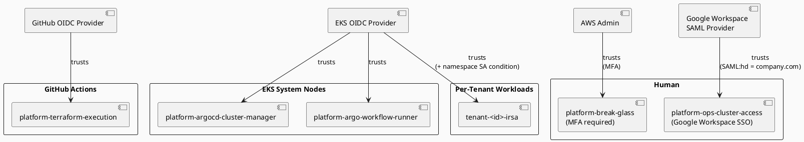
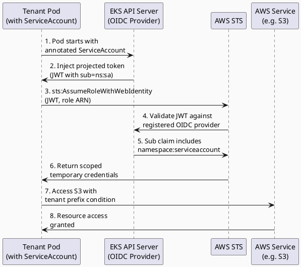

# IAM Design & Conventions

## Principles

* **Least privilege** — every role has only the permissions it needs, nothing more
* **IRSA everywhere** — workloads authenticate to AWS via IAM Roles for Service Accounts, never via node instance profiles
* **No static credentials** — no IAM access keys for any automated process; OIDC or instance metadata only
* **Tenant scoping** — tenant IAM roles are bounded to that tenant's resources via resource-level conditions
* **No cross-tenant access** — IAM policy conditions enforce tenant boundary

## Role Taxonomy



### Management Plane Roles

These roles exist once and manage platform infrastructure.

|     |     |     |
| --- | --- | --- |
| Role | Used By | Purpose |
| `platform-terraform-execution` | GitHub Actions (OIDC) | One-time cluster setup; Terraform apply only |
| `platform-argocd-cluster-manager` | ArgoCD management plane | Cluster registration, kubeconfig generation |
| `platform-argo-workflow-runner` | Argo Workflow pods | Dispatching GHA, reading tenant config from S3 |
| `platform-break-glass` | Human (MFA required) | Emergency read/write access |

### Per-Tenant Roles (IRSA)

These roles are created by the `iam-tenant` Terraform module (one-time, at cluster setup).
Each role has a suffix with the tenant ID, making per-tenant scope explicit.

|     |     |     |     |
| --- | --- | --- | --- |
| Role Pattern | Service Account | Namespace | Permissions |
| `<tenant-id>-external-secrets` | `external-secrets` | `<tenant-id>` | `secretsmanager:GetSecretValue` on `/<tenant-id>/*` |
| `<tenant-id>-thanos-sidecar` | `prometheus` | `monitoring` | `s3:PutObject`, `s3:GetObject` on `<tenant-id>-metrics/*` |
| `<tenant-id>-load-balancer-controller` | `aws-load-balancer-controller` | `kube-system` | ELB management, EC2 describe |
| `<tenant-id>-cluster-autoscaler` | `cluster-autoscaler` | `kube-system` | ASG describe/set desired capacity |
| `<tenant-id>-ebs-csi-driver` | `ebs-csi-controller-sa` | `kube-system` | EC2 volume create/attach/delete |

**Note**: Load balancer controller and cluster autoscaler are shared across all tenants (they run in `kube-system`)
but scoped to tenant-specific resources via resource tagging in their IAM policies.

## Tenant-Scoped ESO Role

Each tenant gets a dedicated External Secrets Operator role scoped to that tenant's namespace.

### Trust Policy

```json
{
  "Version": "2012-10-17",
  "Statement": [
    {
      "Effect": "Allow",
      "Principal": {
        "Federated": "arn:aws:iam::<account-id>:oidc-provider/oidc.eks.<region>.amazonaws.com/id/<cluster-oidc-id>"
      },
      "Action": "sts:AssumeRoleWithWebIdentity",
      "Condition": {
        "StringEquals": {
          "oidc.eks.<region>.amazonaws.com/id/<cluster-oidc-id>:sub":
            "system:serviceaccount:<tenant-id>:external-secrets",
          "oidc.eks.<region>.amazonaws.com/id/<cluster-oidc-id>:aud":
            "sts.amazonaws.com"
        }
      }
    }
  ]
}
```

The `sub` condition binds the role to the External Secrets service account **in the tenant's namespace only**.
A pod in a different namespace or using a different service account cannot assume the role.

### IAM Policy

```json
{
  "Version": "2012-10-17",
  "Statement": [
    {
      "Effect": "Allow",
      "Action": [
        "secretsmanager:GetSecretValue",
        "secretsmanager:DescribeSecret"
      ],
      "Resource": "arn:aws:secretsmanager:<region>:<account-id>:secret:/<tenant-id>/*"
    }
  ]
}
```

Even if the trust policy were compromised, the role can only access secrets under the `/<tenant-id>/*` path
in AWS Secrets Manager. Cross-tenant secret access is blocked at both the IRSA and IAM levels.

## IRSA Trust Pattern



## Shared System Roles Scoped by Resource

Roles used by shared system components (Prometheus, load balancer controller, cluster autoscaler)
are created once but scoped per tenant via resource tags in their IAM policies.

### Example: Thanos Sidecar Role (in Prometheus Pod)

Prometheus runs in the shared `monitoring` namespace and has a service account with an IRSA role
that can write metrics to the S3 bucket. The IAM policy scopes write access per tenant by tenant ID tag:

```json
{
  "Version": "2012-10-17",
  "Statement": [
    {
      "Effect": "Allow",
      "Action": [
        "s3:PutObject",
        "s3:GetObject"
      ],
      "Resource": "arn:aws:s3:::<platform-metrics-bucket>/*",
      "Condition": {
        "StringLike": {
          "s3:x-amz-tagging": "*TenantID=<tenant-id>*"
        }
      }
    }
  ]
}
```

In practice, Prometheus writes to prefix-separated paths (`s3://bucket/<tenant-id>/...`)
and the Thanos sidecar pod sets the tenant ID via its ClusterSecretStore configuration.

## Terraform Execution Role

The `platform-terraform-execution` role assumed by GitHub Actions has permissions for:
* Creating/managing the single EKS cluster (one-time)
* Creating per-tenant IAM roles
* Managing shared resources (VPC, node groups, Prometheus, etc.)

This role is the highest-value target and has strict mitigations:

* Trust policy restricts assumption to the specific GitHub org/repo
* CloudTrail logs all API calls made with this role
* The role cannot modify its own trust policy (deny condition)
* MFA requirement for console assumption (humans only)
* Only used for cluster setup; no per-tenant infrastructure changes

```json
{
  "Effect": "Deny",
  "Action": "iam:UpdateAssumeRolePolicy",
  "Resource": "arn:aws:iam::<account-id>:role/platform-terraform-execution"
}
```

## EKS Cluster Access — Access Entry API

The cluster uses `authentication_mode = "API"` — the legacy `aws-auth` ConfigMap is
**not used**. All cluster access is managed through EKS Access Entries, visible in the
AWS Console under EKS → Cluster → Access and fully auditable via CloudTrail.

### How GitHub Actions gets cluster-admin

The chain has three parts, all in Terraform — no manual steps:

**Part 1 — OIDC trust** (`iam-management` module): the `platform-terraform-execution`
IAM role trusts `token.actions.githubusercontent.com` for the specific org/repo only.

```hcl
condition {
  test     = "StringLike"
  variable = "token.actions.githubusercontent.com:sub"
  values   = ["repo:<org>/<repo>:*"]
}
```

**Part 2 — EKS Access Entry** (`eks-cluster` module): the role is added as an
Access Entry with `AmazonEKSClusterAdminPolicy` at cluster scope.

```hcl
access_entries = merge({
  terraform = {
    principal_arn = var.terraform_role_arn      # platform-terraform-execution ARN
    type          = "STANDARD"
    policy_associations = {
      cluster_admin = {
        policy_arn   = "arn:aws:eks::aws:cluster-access-policy/AmazonEKSClusterAdminPolicy"
        access_scope = { type = "cluster" }
      }
    }
  }
}, ...)
```

**Part 3 — kubeconfig** (`provision-cluster.yaml`): the GHA job assumes the same OIDC
role, then generates a kubeconfig that uses it for token exchange.

```yaml
- uses: aws-actions/configure-aws-credentials@v4
  with:
    role-to-assume: ${{ secrets.TERRAFORM_ROLE_ARN }}   # platform-terraform-execution
    aws-region: ${{ secrets.AWS_REGION }}

- run: aws eks update-kubeconfig --name $CLUSTER_NAME --region $AWS_REGION
```

EKS generates a short-lived token (`aws eks get-token`) at kubectl invocation time.
The token is signed by STS and carries the assumed role ARN. EKS validates it against
the Access Entry table — no ConfigMap lookup involved.

### Access entry summary

| Entry | IAM Role | Access type | Scope | Used by |
|---|---|---|---|---|
| `terraform` | `platform-terraform-execution` | `AmazonEKSClusterAdminPolicy` | cluster | GitHub Actions (OIDC) |
| `break_glass` | `platform-break-glass` | `AmazonEKSClusterAdminPolicy` | cluster | Humans (MFA required) |
| `argocd` | `platform-argocd-cluster-manager` | Kubernetes group `platform:argocd` | RBAC-controlled | ArgoCD IRSA |
| `workflow_runner` | `platform-argo-workflow-runner` | Kubernetes group `platform:workflow-runner` | RBAC-controlled | Argo Workflows IRSA |

The `argocd` and `workflow_runner` entries use `kubernetes_groups` rather than EKS
managed policies so that the platform-rbac ArgoCD app owns the exact permissions via
ClusterRoleBindings — the IAM layer only establishes identity, Kubernetes RBAC controls authorization.

### Why not `system:masters`?

`system:masters` is a built-in Kubernetes group with unconditional cluster-admin that
cannot be audited at the Kubernetes RBAC level. `AmazonEKSClusterAdminPolicy` via
Access Entry is equivalent in practice but all access is visible in CloudTrail and
the AWS Console, and can be revoked without touching the cluster.

## Tenant RBAC vs. IAM

**Kubernetes RBAC** (via Roles/RoleBindings in tenant namespaces):
- Controls in-cluster API access (who can create pods, services, etc.)
- Scoped to namespace (tenant cannot create cluster-scoped resources)
- Managed by platform team; tenants can delegate to their own team members

**IAM IRSA**:
- Controls AWS API access (EC2, S3, Secrets Manager, etc.)
- Tenant workloads assume tenant-specific roles to access AWS resources
- Roles are scoped to tenant via resource conditions

Example flow:
1. Tenant creates a pod that needs to access an S3 bucket
2. Pod has a service account with IRSA annotation linking to `<tenant-id>-s3-reader` role
3. Role policy allows only `<tenant-id>/*` S3 objects
4. Pod's secret is mounted; workload reads secret and calls STS to assume role
5. STS verifies pod identity matches role's trust policy
6. Pod gets temporary credentials scoped to the bucket prefix

## IAM Naming Convention

```
<scope>-<tenant-id|platform>-<component>[-<sub>]

Examples:
  platform-terraform-execution
  platform-argocd-cluster-manager
  platform-argo-workflow-runner
  acme-corp-external-secrets
  acme-corp-thanos-sidecar
  acme-corp-ebs-csi-driver
```

All IAM resource names must follow this pattern. Terraform modules enforce this via local name construction.

## Permission Boundaries

All tenant IRSA roles have a Permission Boundary attached that prevents them from:

* Creating or modifying IAM roles/policies
* Accessing secrets outside their tenant prefix
* Making cross-region API calls (scoped to `aws:RequestedRegion`)

```json
{
  "Version": "2012-10-17",
  "Statement": [
    {
      "Effect": "Allow",
      "Action": "*",
      "Resource": "*"
    },
    {
      "Effect": "Deny",
      "Action": "iam:*",
      "Resource": "*"
    },
    {
      "Effect": "Deny",
      "Action": "secretsmanager:*",
      "Resource": "*",
      "Condition": {
        "StringNotLike": {
          "secretsmanager:SecretId": "arn:aws:secretsmanager:*:*:secret:/<tenant-id>/*"
        }
      }
    },
    {
      "Effect": "Deny",
      "Action": "*",
      "Resource": "*",
      "Condition": {
        "StringNotEquals": {
          "aws:RequestedRegion": "<cluster-region>"
        }
      }
    }
  ]
}
```

## Auditing

All IAM API calls are captured in CloudTrail (organisation-level trail, immutable S3 bucket).
Alerts are configured for:

* Any `iam:CreateRole` or `iam:AttachRolePolicy` outside the Terraform execution role
* Any `sts:AssumeRole` using the break-glass role
* Any failed `sts:AssumeRoleWithWebIdentity` (potential misconfiguration or attack)
* Any cross-region API call from a tenant workload
