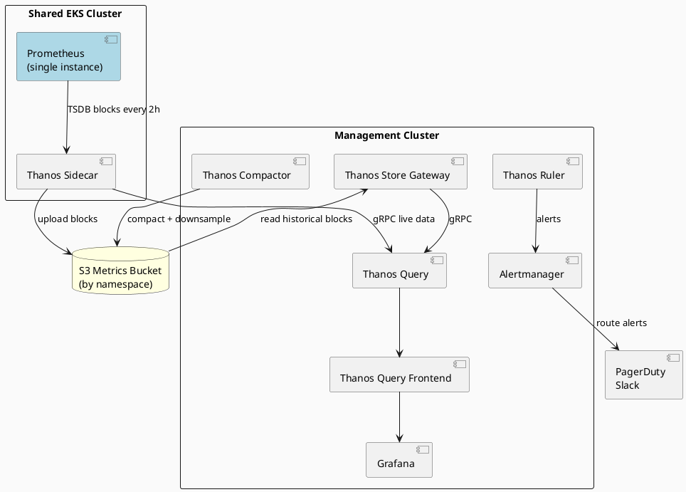
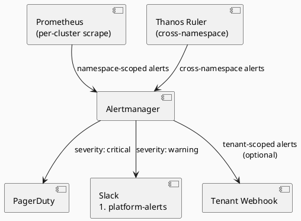

# Monitoring — Prometheus & Thanos

## Architecture Overview

A **single Prometheus instance** runs in the shared cluster and scrapes metrics from all tenant namespaces.
Metrics are labeled with the `namespace` label, enabling per-tenant filtering in Grafana and Thanos.
Thanos components aggregate and store metrics in S3 for long-term retention.



## Single Prometheus Instance

### Deployment

Prometheus is deployed to the shared cluster as a system app via ArgoCD (App-of-Apps).
It runs in the `monitoring` namespace on system nodes.

Chart: `prometheus-community/kube-prometheus-stack`
Values: `system-apps/prometheus/values.yaml` (platform defaults)

### Key Configuration

```yaml
# system-apps/prometheus/values.yaml
prometheus:
  prometheusSpec:
    retention: 2h                  # Short — Thanos handles long-term
    retentionSize: 10GB
    nodeSelector:
      node-role: system
    tolerations:
      - key: node-role
        value: system
        effect: NoSchedule
    externalLabels:
      cluster: "platform-prod"     # Identifies which cluster (shared)
      environment: "production"

    # Scrape all tenant namespaces
    serviceMonitorSelectorNilUsesHelmValues: false
    serviceMonitorNamespaceSelector: {}
    podMonitorSelectorNilUsesHelmValues: false
    podMonitorNamespaceSelector: {}

    # Thanos sidecar configuration
    thanos:
      image:
        tag: v0.34.0
      objectStorageConfig:
        secret:
          type: S3
          config:
            bucket: <platform-metrics-bucket>
            endpoint: s3.amazonaws.com
            region: eu-west-1

# Scrape configs
scrapeConfigs:
  - job_name: kube-state-metrics
    static_configs:
      - targets:
        - localhost:8080

  - job_name: kubernetes-pods
    kubernetes_sd_configs:
      - role: pod
    relabel_configs:
      # Extract namespace label
      - source_labels: [__meta_kubernetes_namespace]
        target_label: namespace
        action: replace

      # Extract pod labels
      - source_labels: [__meta_kubernetes_pod_name]
        target_label: pod
        action: replace
```

### Metric Labels for Tenant Isolation

Every metric includes a `namespace` label that identifies which tenant's namespace the metric came from.
Example:

```
http_requests_total{namespace="acme-corp", pod="api-server-1", instance="10.0.1.5:8080"} 1200
http_requests_total{namespace="globex", pod="api-server-2", instance="10.0.1.6:8080"} 800
```

Grafana dashboards and Thanos queries filter by `{namespace="<tenant-id>"}` to provide
tenant-specific views while using a single Prometheus instance.

## Thanos Sidecar

Runs alongside Prometheus in the same pod. Uploads completed 2-hour TSDB blocks to S3
under a namespace-aware prefix:

```
s3://<platform-metrics-bucket>/
├── acme-corp/
│   └── <block-ulid>/
│       ├── chunks/
│       ├── index
│       └── meta.json
├── globex/
│   └── <block-ulid>/
│       └── ...
└── kube-system/
    └── ...
```

The block structure includes namespace information. IRSA role `platform-thanos-sidecar`
grants `s3:PutObject` to the entire bucket (no per-tenant restriction needed since blocks are
naturally segregated by namespace prefix).

## Management Cluster — Thanos Components

### Thanos Query

The central query interface. Federates over the live Prometheus sidecar (gRPC) and
the Store Gateway (S3 historical data).

Queries can span all namespaces:
```
sum(rate(http_requests_total[5m])) by (namespace)
```

### Thanos Store Gateway

Reads historical metric blocks from S3 and serves them over gRPC to Thanos Query.
One Store Gateway per region. Index caching enabled (in-memory).

### Thanos Compactor

Runs as a single instance (only one compactor per S3 bucket).

Downsampling schedule:

|     |     |     |
| --- | --- | --- |
| Data | Downsampled After | Deleted After |
| Raw | 40 days → 5m resolution | 90 days |
| 5m resolution | 10 months → 1h resolution | 365 days |
| 1h resolution | Never downsampled | Never deleted |

### Thanos Ruler

Evaluates recording and alerting rules across all tenant metrics.
Enables cross-tenant alerting and platform-wide SLO breach detection.

### Thanos Query Frontend

Caching layer in front of Thanos Query. Uses in-cluster Redis or Memcached.
Cache key includes namespace to prevent cross-tenant data leakage.

## Grafana

Deployed to the management cluster with Thanos Query as its datasource.
Dashboards are provisioned as ConfigMaps (GitOps-managed).

|     |     |
| --- | --- |
| Dashboard | Purpose |
| `platform-overview` | All tenants at a glance (cluster CPU, memory, pod count) |
| `tenant-detail` | Per-tenant drill-down (uses `namespace` variable) |
| `node-resources` | Node CPU/memory/disk across workload nodes |
| `kubernetes-workloads` | Deployment/pod health per namespace |
| `argo-workflows` | Workflow success/failure rates |

Authentication: SSO via OIDC (same provider as ArgoCD).

### Multi-Tenant Dashboard Example

```json
{
  "dashboard": {
    "title": "Tenant Detail",
    "panels": [
      {
        "title": "CPU Usage",
        "targets": [
          {
            "expr": "sum(rate(container_cpu_usage_seconds_total{namespace=\"$tenant\"}[5m])) by (pod)"
          }
        ]
      }
    ],
    "templating": {
      "list": [
        {
          "name": "tenant",
          "type": "query",
          "datasource": "Thanos",
          "query": "label_values(container_cpu_usage_seconds_total, namespace)"
        }
      ]
    }
  }
}
```

Grafana's variable `$tenant` is dynamically populated from the `namespace` label values.

## Alerting

### Alert Routing



### Platform Alerting Rules

|     |     |     |
| --- | --- | --- |
| Alert | Condition | Severity |
| `ClusterDown` | Prometheus target missing > 5m | critical |
| `NodeNotReady` | Node NotReady > 5m | critical |
| `HighMemoryUsage` | Node memory > 85% for 15m | warning |
| `PodCrashLooping` | Pod restart rate > 5 in 10m | warning |
| `ArgoCDAppDegraded` | App health = Degraded > 5m | warning |
| `ThanosCompactHalted` | Compactor halted | critical |
| `MetricIngestionDelay` | Block upload delay > 3h | warning |
| `TenantNamespaceQuotaExceeded` | Namespace at 90% quota | warning |
| `PrometheusTargetDown` | ServiceMonitor target down > 5m | warning |

### Per-Tenant Alerts

Tenants can define their own alerting rules in their namespace via PrometheusRule resources.
The Prometheus service monitor discovery includes all namespaces, so tenant rules are
automatically scraped and evaluated.

```yaml
# In tenant namespace
apiVersion: monitoring.coreos.com/v1
kind: PrometheusRule
metadata:
  name: acme-app-alerts
  namespace: acme-corp
spec:
  groups:
  - name: acme.rules
    interval: 30s
    rules:
    - alert: HighErrorRate
      expr: |
        (sum(rate(http_requests_total{namespace="acme-corp", status=~"5.."}[5m])) /
         sum(rate(http_requests_total{namespace="acme-corp"}[5m]))) > 0.05
      for: 5m
      annotations:
        summary: "High error rate in Acme API"
```

Tenant alerts are namespace-scoped; they cannot reference metrics from other namespaces.

## Tenant Metrics Isolation

Isolation is achieved through three layers:

1. **Scrape-time labels**: Every metric includes `namespace` label set during scrape config
2. **Grafana filtering**: Dashboards query `{namespace="<tenant-id>"}` to isolate views
3. **RBAC on Prometheus**: Tenants cannot access Prometheus UI; only read via Grafana (with filtering)

The S3 bucket structure (namespace-prefixed blocks) provides additional logical separation.

## Retention Summary

|     |     |     |     |
| --- | --- | --- | --- |
| Tier | Location | Resolution | Retention |
| Live | Prometheus | Raw | 2 hours |
| Recent | S3 raw blocks | Raw | 90 days |
| Medium-term | S3 compacted | 5m | 1 year |
| Long-term | S3 downsampled | 1h | Indefinite |

## Adding a New Tenant to Monitoring

Performed by the `configure-monitoring` step in the `tenant-onboard` Argo Workflow:

1. Prometheus automatically scrapes all namespaces (no configuration change needed)
2. Metrics with `namespace=<tenant-id>` label are automatically sent to Thanos sidecar
3. Verify tenant metrics appear in Thanos Query
4. Optionally create Grafana tenant folder for dashboard access

```bash
# Verify tenant metrics in Thanos
thanos query --store.addresses=<store-gateway> \
  --query.replica-label=replica \
  --web.console.templates=consoles \
  --web.console.libraries=console_libraries

# Query: {namespace="new-tenant"}
# Should show metrics from new tenant namespace
```

## Removing a Tenant's Metrics

When a tenant is offboarded:

1. Thanos Query stops ingesting new metrics (no pods in that namespace)
2. Existing metrics in S3 are moved to cold storage: `s3://bucket/cold/<tenant-id>/...`
3. Grafana dashboards can still query historical data from cold storage (if retention allows)
4. Optional: delete S3 objects after configurable retention period
