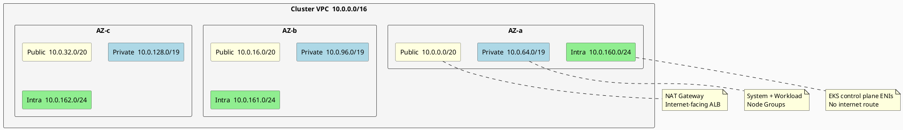
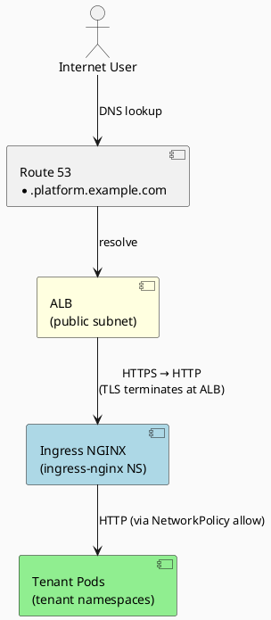

# Network Topology

## Design Principles

* **Single shared VPC** — the EKS cluster and all tenant workloads run in one VPC
* **Namespace isolation via NetworkPolicy** — Kubernetes NetworkPolicy enforces default-deny between namespaces
* **Private-first infrastructure** — worker nodes in private subnets; public subnets host NAT gateways and ALBs only
* **Least-exposure ingress** — external traffic enters via ALB → Ingress NGINX → tenant pods, all encrypted

## VPC Layout



**Intra subnets** have no route to the internet (no IGW, no NAT). They host the EKS control plane
cross-account ENIs only, ensuring the API server is never directly reachable from the public internet.

## Routing

### Public Subnets

|     |     |
| --- | --- |
| Destination | Target |
| `0.0.0.0/0` | Internet Gateway |
| `10.0.0.0/16` | Local |

### Private Subnets

|     |     |
| --- | --- |
| Destination | Target |
| `0.0.0.0/0` | NAT Gateway (same AZ) |
| `10.0.0.0/16` | Local |

### Intra Subnets

|     |     |
| --- | --- |
| Destination | Target |
| `10.0.0.0/16` | Local only (no internet route) |

## EKS API Server Access

|     |     |
| --- | --- |
| Setting | Value |
| Public endpoint | Disabled (production) / Enabled with allowlist (staging) |
| Private endpoint | Enabled |
| API allowlist | Management VPC CIDR only |

## Security Groups

### EKS Cluster Security Group (Control Plane)

|     |     |     |     |
| --- | --- | --- | --- |
| Rule | Direction | Port | Source/Dest |
| Node to control plane | Ingress | 443 | Worker node SG |
| Control plane to node | Egress | 10250 | Worker node SG |

### Worker Node Security Group

|     |     |     |     |
| --- | --- | --- | --- |
| Rule | Direction | Port | Source/Dest |
| Intra-node | Ingress | All | Self |
| Control plane | Ingress | 10250 | Control plane SG |
| LB to pod | Ingress | App ports | ALB SG |
| All egress | Egress | All | 0.0.0.0/0 |

## Kubernetes Network Policy

All tenant namespaces have a default-deny NetworkPolicy applied during onboarding.

### Default-Deny Policy

```yaml
apiVersion: networking.k8s.io/v1
kind: NetworkPolicy
metadata:
  name: default-deny-ingress
  namespace: <tenant-namespace>
spec:
  podSelector: {}
  policyTypes:
  - Ingress
```

### Explicit Allow Rules

Tenants can define their own NetworkPolicy rules, but the following system allows are pre-configured:

| Source | Destination | Port | Purpose |
| --- | --- | --- | --- |
| ingress-nginx pod | tenant pod | 80, 443, app ports | Ingress traffic |
| CoreDNS pod (kube-system) | tenant pod | 53 | DNS lookups |
| Prometheus pod (monitoring) | tenant pod | 9090, metrics port | Metrics scraping |
| Kubernetes API server | tenant pod | 443 | API server webhooks, kubelet calls |

### Inter-Namespace Communication

Tenants cannot reach pods in other namespaces. Explicit cross-namespace NetworkPolicy rules
are blocked via Gatekeeper constraint (prevents `namespaceSelector` in pod-level policies).

## Ingress Architecture



AWS Load Balancer Controller manages the ALB lifecycle from Kubernetes Ingress resources.
All TLS terminates at the ALB. Backend traffic to ingress-nginx uses HTTP internally.

Ingress NGINX runs in the `ingress-nginx` namespace on system nodes and routes to tenant pods
via service endpoints (allowed by NetworkPolicy).

## DNS

* **Cluster DNS**: CoreDNS in `kube-system` namespace, reachable from all tenant pods via NetworkPolicy allow rule
* **External DNS**: Each tenant service is exposed via: `<service>.<tenant-id>.platform.example.com`
* **Certificate management**: cert-manager (in `cert-manager` namespace) with Let's Encrypt (ACME DNS-01 via Route 53)
* **Private service discovery**: CoreDNS; tenant pods can reach other services in the same namespace by `<service>.<namespace>.svc.cluster.local`

## Service-to-Service Communication

Within a namespace, pods can reach other services via Kubernetes DNS without additional NetworkPolicy rules.
Cross-namespace communication requires an explicit NetworkPolicy with `namespaceSelector` — this is
blocked by Gatekeeper for tenant namespaces, preventing accidental or malicious cross-tenant communication.

## Egress Control

By default, tenant pods can reach external services (e.g., AWS APIs, external APIs) via the NAT gateway.
Egress filtering can be applied per namespace via NetworkPolicy if needed:

```yaml
apiVersion: networking.k8s.io/v1
kind: NetworkPolicy
metadata:
  name: restrict-egress
  namespace: acme-corp
spec:
  podSelector: {}
  policyTypes:
  - Egress
  egress:
  - to:
    - namespaceSelector:
        matchLabels:
          name: kube-system
    ports:
    - protocol: UDP
      port: 53
  - to:
    - namespaceSelector:
        matchLabels:
          name: acme-corp
  - to:
    - podSelector: {}
      namespaceSelector:
        matchLabels:
          name: ingress-nginx
```

Tenants manage their own egress rules in their namespace; Gatekeeper enforces that they
cannot bypass platform-level denies (e.g., no wild-all rules without approval).

## Multi-AZ High Availability

The cluster spans 3 availability zones (configurable):
- System and workload node groups are distributed across all AZs
- EKS control plane is managed by AWS and replicated across AZs
- Tenant workloads should use pod anti-affinity for resilience
- NAT gateways and ALBs have one instance per AZ for egress/ingress resilience
