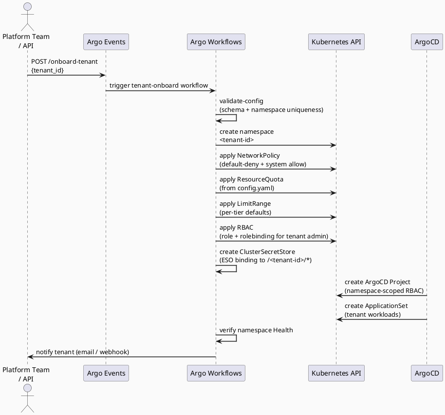
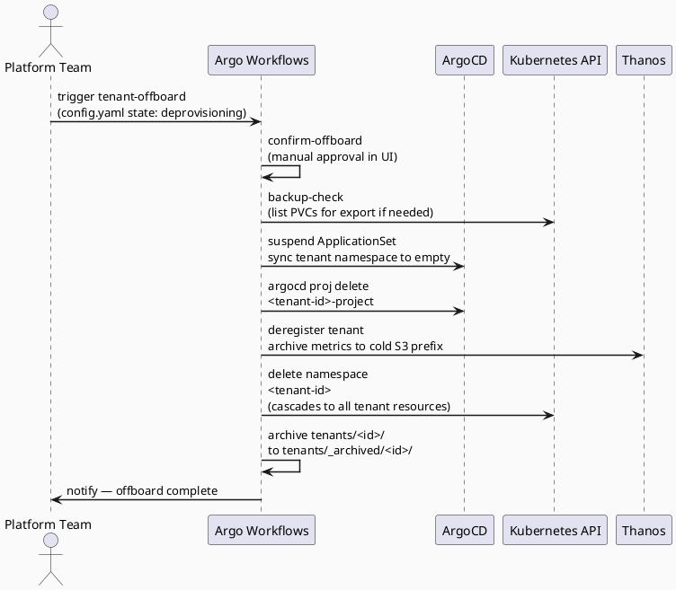

# Tenant Lifecycle

## Overview

A tenant's lifecycle has four phases: **Onboarding**, **Steady State**, **Modification**, and **Offboarding**.
Each phase is driven by Argo Events (trigger) → Argo Workflows (orchestration) → Kubernetes operations.
Tenant onboarding is fast (~2-3 minutes) because it operates entirely at the Kubernetes level with no infrastructure provisioning.

## Tenant Configuration

Every tenant is represented by a directory at `tenants/<tenant-id>/` containing:

```
tenants/<tenant-id>/
├── config.yaml          # Tenant metadata, namespace, quotas, tier
├── values/              # App-of-Apps value overrides
│   └── app-of-apps.yaml
└── argocd/              # Tenant ArgoCD application definitions
    └── apps.yaml
```

### config.yaml Schema

```yaml
tenant:
  id: acme-corp                    # Unique, immutable, used as namespace/resource prefix
  name: Acme Corporation
  tier: standard                   # standard | premium | enterprise
  region: eu-west-1               # Cluster region (informational)
  owner_email: platform@acme.com

namespace:
  name: acme-corp                  # Kubernetes namespace (defaults to tenant.id)

quotas:
  requests.cpu: "4"                # Total CPU requests in namespace
  requests.memory: 8Gi             # Total memory requests in namespace
  limits.cpu: "8"                  # Total CPU limits in namespace
  limits.memory: 16Gi              # Total memory limits in namespace
  pods: "50"                       # Max pods in namespace
  services: "10"                   # Max services in namespace
  persistentvolumeclaims: "10"     # Max PVCs in namespace

state: active                      # active | suspended | deprovisioning
created_at: "2025-01-15T10:00:00Z"
```

### Quota Tiers

Quotas are scaled per tier. Defaults:

| Tier | CPU Request | Memory Request | CPU Limit | Memory Limit | Pods | Services |
| --- | --- | --- | --- | --- | --- | --- |
| standard | 4 | 8Gi | 8 | 16Gi | 50 | 10 |
| premium | 16 | 32Gi | 32 | 64Gi | 200 | 50 |
| enterprise | 64 | 128Gi | 128 | 256Gi | 1000 | 100 |

Override in tenant config.yaml `quotas:` section.

## Phase 1: Onboarding

### Trigger

Onboarding is initiated by one of:

* Webhook POST to the Argo Events webhook source (`/onboard-tenant`)
* Manual trigger via the platform CLI (`platform tenant create --config config.yaml`)
* GitHub PR merge adding `tenants/<new-tenant-id>/config.yaml`

### Onboarding Flow



### Onboarding Duration

| Phase | Typical Duration |
| --- | --- |
| Namespace creation + policies | ~30 seconds |
| RBAC + ESO setup | ~30 seconds |
| ArgoCD project + ApplicationSet | ~30 seconds |
| **Total** | **~2-3 minutes** |

This is **dramatically faster** than the previous dedicated-cluster model (20-30 minutes)
because no infrastructure provisioning is required.

## Phase 2: Steady State

In steady state, the platform operates via GitOps with no active workflow running.

* **ArgoCD** continuously reconciles tenant workloads against Git state (ApplicationSet per tenant)
* **Prometheus** scrapes all tenant namespaces; metrics tagged with `namespace` label
* **Thanos sidecar** ships metric blocks to S3 every 2 hours (single Prometheus instance)
* **External Secrets Operator** syncs secrets from AWS Secrets Manager per tenant's ClusterSecretStore
* **Gatekeeper** enforces admission constraints (prevents privileged pods, host access, etc.)
* **NetworkPolicy** enforces default-deny; ingress controller and external IPs allowed per namespace

Tenant teams interact with their namespace via the ArgoCD UI/API, their kubeconfig (RBAC-scoped),
or the Kubernetes API. They cannot access other namespaces or modify cluster-scoped resources.

## Phase 3: Modification

### Quota Adjustment

Triggered by PR to `tenants/<tenant-id>/config.yaml` changing `quotas:` fields.

Workflow `tenant-adjust-quotas`:

1. Validate new quotas against current usage (not shrinking below current requests)
2. Apply new ResourceQuota manifest
3. Apply new LimitRange manifest
4. Verify quota is enforced (test pod creation with new limits)

### Tier Upgrade

Triggered by PR changing `tenant.tier` (e.g., `standard` → `premium`).

Workflow `tenant-upgrade-tier`:

1. Look up new quota tier defaults
2. Apply new quotas (via tenant-adjust-quotas)
3. Optional: scale up node group if cluster resource pressure detected
4. Notify tenant of upgraded limits

### Tenant Suspension

Sets `state: suspended` in config.yaml.

Workflow `tenant-suspend`:

1. Set ResourceQuota to 0 for all resources (evicts all pods)
2. Pause ArgoCD ApplicationSet sync for tenant
3. Suppress monitoring alerts for tenant

### Resume Suspended Tenant

Sets `state: active` in config.yaml.

Workflow `tenant-resume`:

1. Restore original ResourceQuota
2. Resume ArgoCD ApplicationSet sync
3. Re-enable monitoring alerts

## Phase 4: Offboarding

### Offboarding Flow



### Data Retention After Offboarding

* **Metrics**: Tenant metrics in S3 are moved to cold storage prefix (`s3://.../cold/<tenant-id>/...`)
* **Terraform state**: Cluster state remains (shared cluster is not destroyed)
* **Secrets**: Tenant secrets in AWS Secrets Manager are optionally retained or deleted per retention policy
* **Config**: Tenant directory is archived to `tenants/_archived/<tenant-id>/` for audit trail

## Tenant Isolation Guarantees

| Boundary | Mechanism |
| --- | --- |
| Network | Default-deny NetworkPolicy; explicit allow rules per namespace for ingress, CoreDNS, API server, Prometheus |
| Compute | ResourceQuota + LimitRange enforced by Kubernetes API; Gatekeeper blocks resource abuse |
| Storage | PVCs scoped to namespace; no cross-namespace volume mounts |
| Secrets | ClusterSecretStore scoped to `/<tenant-id>/*`; ESO RBAC limits to tenant service accounts |
| RBAC | Namespace-scoped service accounts and roles; Gatekeeper prevents cluster-scoped creations |
| Pod Security | Gatekeeper constraints prevent: privileged pods, hostNetwork, host mounts, system taint toleration |
| Monitoring | Prometheus metrics tagged with `namespace` label; Grafana dashboards filter by namespace |

## Tenant ID Conventions

* Format: `[a-z0-9-]+`, max 32 characters
* Used as Kubernetes namespace name and resource prefix
* Must be globally unique within the platform
* **Immutable once created** — changing it requires full offboard + onboard cycle
