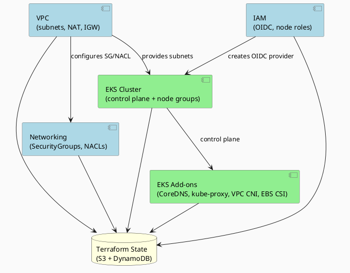
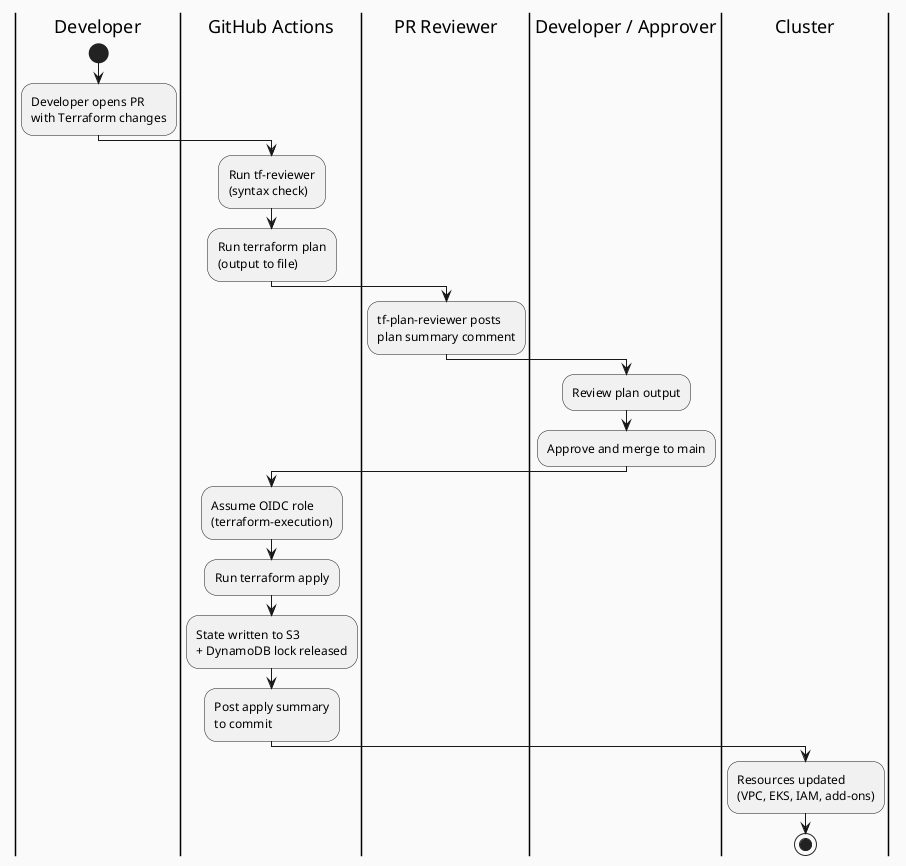

# Terraform Conventions

## Overview

Terraform is used **only for one-time cluster setup** — provisioning the shared EKS cluster, VPC, node groups,
and management plane infrastructure. Per-tenant provisioning happens entirely at the Kubernetes level
via Argo Workflows and is captured in `tenants/<tenant-id>/config.yaml`.

## Module Structure

```
src/terraform/
├── modules/
│   ├── eks-cluster/          # EKS control plane + managed node groups
│   ├── vpc/                  # VPC, subnets, IGW, NAT, route tables
│   ├── iam-management/       # Platform-level IAM (Terraform-managed roles; execution role is in CFN)
│   ├── iam-tenant-roles/     # Per-tenant IRSA roles (created once, used by all tenants)
│   ├── eks-addons/           # EKS managed addons + IRSA roles (EBS CSI, VPC CNI, CA, metrics-server)
│   ├── networking/           # SecurityGroups, NACL rules
│   └── monitoring/           # Prometheus, Thanos, Grafana
├── environments/
│   └── production/           # Single environment for the shared cluster
└── cluster.tfvars            # Cluster-level configuration (NOT per-tenant)
```



## Key Change: No Per-Tenant Terraform

In the old model, each tenant got a `tenants/<tenant-id>/terraform.tfvars` file with cluster-specific config.
In the new model, there is **no per-tenant Terraform**.

All cluster infrastructure is provisioned once. Tenant onboarding is done via:
- Argo Workflows (Kubernetes-level operations)
- Kubernetes manifests (NetworkPolicy, ResourceQuota, RBAC)
- External Secrets Operator (secret scoping)
- ArgoCD (application deployment)

## State Management

### Backend Configuration

The cluster shares a single Terraform state file in S3:

```hcl
# backend.tf
terraform {
  backend "s3" {
    bucket         = "<platform-state-bucket>"
    key            = "cluster/terraform.tfstate"
    region         = "eu-west-1"
    dynamodb_table = "terraform-locks"
    encrypt        = true
  }
}
```

There are **no per-tenant state files** because there is no per-tenant infrastructure.



### State Bucket Policy

* Versioning: enabled
* Encryption: SSE-S3 (or SSE-KMS for compliance)
* MFA delete: enabled
* Access: only the Terraform execution role and break-glass role
* Lifecycle: non-current versions retained for 90 days

## Module: `vpc`

### Inputs

|     |     |     |
| --- | --- | --- |
| Variable | Type | Description |
| `cluster_name` | string | Used as resource name prefix |
| `vpc_cidr` | string | e.g., `10.0.0.0/16` (single shared VPC) |
| `availability_zones` | number | 2 or 3 |
| `region` | string | AWS region |
| `tags` | map(string) | Common tags |

### Outputs

* `vpc_id`
* `private_subnet_ids` (list)
* `public_subnet_ids` (list)
* `intra_subnet_ids` (list, for EKS control plane ENIs)

### Subnet Layout (3-AZ example, /16 VPC)

|     |     |     |
| --- | --- | --- |
| Subnet Type | CIDR Pattern | Purpose |
| Public | /20 × 3 | NAT gateways, load balancers |
| Private | /19 × 3 | System and workload node groups |
| Intra | /24 × 3 | EKS control plane ENIs (no internet route) |

## Module: `eks-cluster`

### Key Design Choices

* Single managed EKS cluster (not per-tenant)
* Managed node groups: system (tainted, t3.large/m5.large) and workload (untainted, t3.medium/m5.large/m5.xlarge)
* `authentication_mode = "API"` — EKS Access Entry API only; no `aws-auth` ConfigMap. All cluster access visible in AWS Console and CloudTrail.
* `enable_cluster_creator_admin_permissions = false` — explicit access entries only; no implicit cluster-admin for the caller
* Private API endpoint always enabled; public endpoint enabled in dev (GitHub Actions runners need cluster access)
* IRSA enabled (IAM OIDC provider created once by the EKS module)
* Envelope encryption of etcd with a customer-managed KMS key (7-day deletion window, key rotation enabled)
* Node group IAM roles pre-created outside the EKS module — prevents unknown `for_each` keys crashing the plan on a fresh apply
* `AmazonSSMManagedInstanceCore` attached to both node group roles — enables Session Manager shell access without SSH keys

### Inputs

|     |     |     |
| --- | --- | --- |
| Variable | Type | Description |
| `cluster_name` | string | Cluster name (e.g., `platform-prod`) |
| `kubernetes_version` | string | e.g., `"1.29"` (single version for all tenants) |
| `vpc_id` | string | From vpc module output |
| `subnet_ids` | list | Private subnets for nodes |
| `control_plane_subnet_ids` | list | Intra subnets for control plane |
| `node_groups` | map(object) | Node group definitions (system + workload) |
| `kms_key_arn` | string | For etcd encryption |

### Node Group Object Schema

```hcl
# system node group — platform components (ArgoCD, Prometheus, Gatekeeper, etc.)
system = {
  instance_types = ["t3.large", "m5.large"]   # burstable + on-demand fallback
  min_size       = 0                           # min=0 allows suspend Lambda to fully drain
  max_size       = 3
  desired_size   = 2
  disk_size      = 50
  labels         = { "node-role" = "system" }
  taints         = [{ key = "node-role", value = "system", effect = "NO_SCHEDULE" }]
  # NOT tagged for CA auto-discovery — managed by suspend Lambda only
}

# workload node group — tenant application pods
workload = {
  instance_types = ["t3.medium", "m5.large", "m5.xlarge"]   # CA picks cheapest that fits
  min_size       = 0                                          # scale-from-zero enabled
  max_size       = 20
  desired_size   = 0                                          # starts empty; CA brings up nodes
  disk_size      = 50
  labels         = { "node-role" = "workload" }
  taints         = []
  # CA auto-discovery tags + scale-from-zero resource hints (cpu=2, memory=4Gi)
}
```

**System node group scaling** is controlled by a Lambda/EventBridge schedule (suspend at end of day,
resume at start). The group is excluded from CA auto-discovery intentionally.

**Workload node group scaling** is fully managed by Cluster Autoscaler. `desired_size=0` on provision;
CA scales up when tenant pods are pending and scales down when nodes are idle for 5 minutes.

## Module: `iam-tenant-roles`

Creates all per-tenant IAM roles at cluster setup time (once). These roles are reused
whenever a tenant is onboarded.

|     |     |     |
| --- | --- | --- |
| Role | Used By | Permissions |
| `<tenant-id>-external-secrets` | External Secrets in tenant namespace | `secretsmanager:GetSecretValue` scoped to `/<tenant-id>/*` |
| `<tenant-id>-thanos-sidecar` | Prometheus (shared, in monitoring NS) | `s3:PutObject` to tenant metrics bucket |
| `<tenant-id>-load-balancer` | AWS Load Balancer Controller (shared, kube-system) | ELB management for tenant ALBs |
| `<tenant-id>-cluster-autoscaler` | Cluster Autoscaler (shared, kube-system) | ASG describe/update for tenant node groups |
| `<tenant-id>-ebs-csi` | EBS CSI driver (shared, kube-system) | EC2 volume management scoped to tenant |

Roles are created from a Terraform variable list of tenant IDs:

```hcl
variable "tenant_ids" {
  type = list(string)
  default = [
    "acme-corp",
    "globex",
    # ... more tenants
  ]
}

module "iam_tenant_roles" {
  source = "./modules/iam-tenant-roles"

  for_each = toset(var.tenant_ids)

  tenant_id              = each.value
  cluster_oidc_issuer    = module.eks.oidc_provider_arn
  metrics_bucket_name    = module.monitoring.metrics_bucket
  state_bucket_name      = module.monitoring.state_bucket
}
```

## Module: `eks-addons`

Manages EKS managed addons and the IRSA roles they require.

**Addons:**
* `coredns` — configured with system node toleration/nodeSelector so it schedules when workload nodes are at 0
* `kube-proxy` — DaemonSet, no configuration override needed
* `vpc-cni` — IRSA role (`<cluster>-vpc-cni`) with `AmazonEKS_CNI_Policy`
* `aws-ebs-csi-driver` — IRSA role (`<cluster>-ebs-csi-driver`); controller Deployment configured for system nodes
* `metrics-server` — configured with system node toleration/nodeSelector

**IRSA roles created here (not in `iam-management`):**
* `<cluster>-ebs-csi-driver` — `AmazonEBSCSIDriverPolicy`
* `<cluster>-vpc-cni` — `AmazonEKS_CNI_Policy`
* `<cluster>-cluster-autoscaler` — scoped inline policy: read actions on `*`, write actions (`SetDesiredCapacity`, `TerminateInstanceInAutoScalingGroup`) conditioned on CA auto-discovery ASG tags

All addon Deployments that require scheduling on system nodes carry both a `tolerations` block and a `nodeSelector` via `configuration_values`. Without these, pods remain `Pending` when workload `desired_size=0`.

## Module: `iam-management`

One-time setup for Terraform-managed platform roles:

* `platform-argocd-cluster-manager` — ArgoCD IRSA role (EKS OIDC trust)
* `platform-argo-workflow-runner` — Argo Workflows pods IRSA role
* `platform-break-glass` — Emergency access role (MFA required)
* `platform-ops-cluster-access` — Engineer kubectl access via Google Workspace SSO

> **`platform-terraform-execution` is NOT in this module.** It is defined in
> `bootstrap/cfn-iam.yaml` (CloudFormation) to avoid a chicken-and-egg dependency.
> GitHub org and repo are CFN parameters. See `docs/iam-conventions.md` for details.

## Tagging Convention

All resources must have the following tags:

```hcl
tags = {
  Platform    = "eks-platform"
  ClusterName = var.cluster_name
  Environment = var.environment      # staging | production
  ManagedBy   = "terraform"
  Repository  = "org/platform-repo"
}
```

Tag enforcement is applied via AWS Config rule. Resources without `ClusterName` and `ManagedBy`
tags trigger an alert to the platform team.

## Version Pinning

```hcl
terraform {
  required_version = ">= 1.7.0"

  required_providers {
    aws = {
      source  = "hashicorp/aws"
      version = "~> 5.40"
    }
    kubernetes = {
      source  = "hashicorp/kubernetes"
      version = "~> 2.27"
    }
  }
}
```

Provider versions are pinned in `src/terraform/.terraform.lock.hcl` which is committed to the repo.
Do not update provider versions without testing in staging first.

## Drift Detection

A scheduled GitHub Actions workflow (`plan-cluster.yaml`) runs daily and posts
a plan summary if drift is detected. Any non-empty plan (unexpected drift) triggers
a Slack alert to `#platform-alerts`.

Legitimate drift (e.g., AWS-managed updates to EKS addons) should be resolved by
applying the plan and committing any resulting config changes.

```bash
# Drift detection workflow
terraform plan -out=plan.tfplan

# If drift detected, review and apply
terraform apply plan.tfplan
```

## Common Operations

### Adding a New Tenant (No Terraform Required!)

1. Create `tenants/<tenant-id>/config.yaml` with namespace and quota definitions
2. Merge PR to main branch
3. Trigger Argo Workflow: `platform tenant create --config tenants/<tenant-id>/config.yaml`
4. Workflow creates namespace, applies policies, creates ArgoCD project
5. Done! (No infrastructure provisioning needed)

### Scaling Workload Nodes

Workload nodes are managed by Cluster Autoscaler — no manual intervention needed for
day-to-day scaling. CA scales up when pods are pending and scales down when nodes are
idle for 5 minutes.

To increase the **ceiling** (maximum allowed nodes), update `kubernetes_version` is in
`terraform.tfvars` and edit the workload group `max_size` in `eks-cluster/main.tf`:

```hcl
# src/terraform/modules/eks-cluster/main.tf
workload = {
  max_size = 30  # Was 20 — increase when total tenant capacity approaches the limit
}
```

Apply via the provision-cluster GitHub Actions workflow. The change takes effect
immediately — CA can now scale beyond the previous ceiling.

### Upgrading Kubernetes Version

Edit `src/terraform/cluster.tfvars` and update `kubernetes_version`:

```hcl
kubernetes_version = "1.30"  # Was 1.29
```

Run plan/apply. EKS managed upgrade handles control plane; node groups roll for new AMI.
All tenants are upgraded simultaneously (maintenance window required).

### Creating Tenant IAM Roles for a New Tenant

Add tenant ID to `src/terraform/cluster.tfvars`:

```hcl
variable "tenant_ids" {
  default = [
    "acme-corp",
    "globex",
    "new-tenant",  # Add here
  ]
}
```

Apply Terraform to create IAM roles. Then proceed with Kubernetes-level onboarding.

## Disaster Recovery

If Terraform state is corrupted or lost:

```bash
# Backup current state (if accessible)
terraform state pull > backup.tfstate

# Recover from S3 versioning
aws s3api get-object \
  --bucket <platform-state-bucket> \
  --key cluster/terraform.tfstate \
  --version-id <version-id> \
  recovered.tfstate

# Use break-glass role if needed (requires MFA + approval)
aws sts assume-role --role-arn arn:aws:iam::<account-id>:role/platform-break-glass \
  --role-session-name recovery \
  --duration-seconds 3600
```

See runbooks in `docs/runbooks/` for full recovery procedures.
